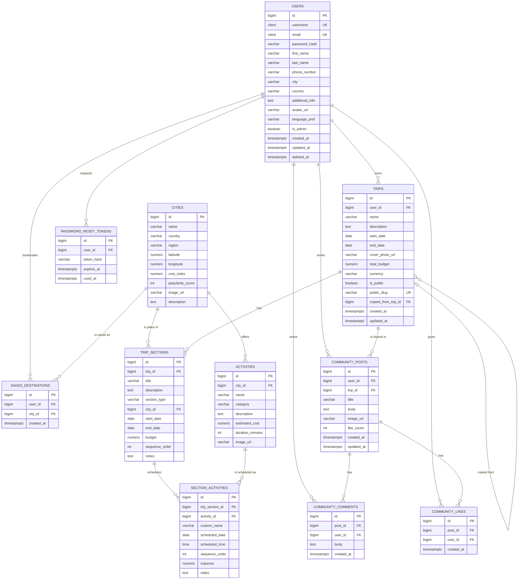

# 🗄️ Database Design — GlobeTrotter

> **The most important document in the project.** Odoo weights *database design* highest, and the brief demands "proper use of relational databases." This schema is aligned to the **official organizer wireframe** (12 screens): a **Sections-based itinerary**, a **Community** feed, rich user profiles, and trip grouping by status. Fully normalized (3NF), integrity enforced by real constraints, indexed for the app's actual queries.

- **Engine:** PostgreSQL 16 (self-hosted — no BaaS)
- **Access:** SQLAlchemy 2.0 ORM, versioned with Alembic
- **Naming note:** product name is **GlobeTrotter** (PDF title); the in-app logo/header reads **"GlobalTrotter"** per the wireframe. Same product.

---

## 1. Conceptual Model (aligned to the wireframe)

A **User** (full profile: name, phone, city, country, photo, bio) owns many **Trips**. A Trip is an ordered list of **Sections** — and per the wireframe a Section is *"anything: a travel leg, a hotel, or an activity"*, each with its own **date range** and **budget**. Each Section (optionally tied to a **City/Place**) holds day-wise **Section Activities** (the "Physical Activity + Expense" rows in the itinerary view), drawn from a searchable **Activities** catalog. Users share trips on a **Community** feed (posts, likes, comments). Trips can also be made **public** (shareable link + *Copy Trip*). Trip status (**Ongoing / Up-coming / Completed**) is derived from its dates.

---

## 2. Entity–Relationship Diagram



---

## 3. Table Specifications

Legend: **PK** primary key · **FK** foreign key · **UK** unique · **NN** not null.

### 3.1 `users`  *(Screens 1 & 2 — Login / Registration)*
Login is by **username + password** (Screen 1). Registration (Screen 2) collects the full profile. Passwords are hashed (bcrypt); account deletion is a **soft delete**.

| Column | Type | Constraints | Notes |
|--------|------|-------------|-------|
| id | bigint | PK | |
| username | `citext` | UK, NN | login identifier (Screen 1) |
| email | `citext` | UK, NN | from registration |
| password_hash | varchar(255) | NN | bcrypt (wireframe omits the field on Screen 2; still required) |
| first_name | varchar(80) | NN | Screen 2 |
| last_name | varchar(80) | NN | Screen 2 |
| phone_number | varchar(20) | | Screen 2 |
| city | varchar(120) | | Screen 2 |
| country | varchar(120) | | Screen 2 |
| additional_info | text | | Screen 2 "Additional Information" / profile bio |
| avatar_url | varchar(500) | | Screen 2 "Photo" |
| language_pref | varchar(10) | NN, default `'en'` | profile setting |
| is_admin | boolean | NN, default false | gates Admin Panel (Screen 12) |
| created_at / updated_at / deleted_at | timestamptz | | soft delete |

**Constraints:** `CHECK (phone_number ~ '^[0-9+\-() ]{7,20}$' )` when present.

### 3.2 `cities` (reference — seeded, real)  *(Screens 4, 8; "Top Regional Selections")*
Master list users search and "Select a Place" from. `cost_index` feeds budget hints; `popularity_score` powers "Top Regional Selections" (Screen 3) and Admin "Popular cities" (Screen 12).

| Column | Type | Constraints | Notes |
|--------|------|-------------|-------|
| id | bigint | PK | |
| name | varchar(120) | NN | |
| country | varchar(120) | NN | |
| region | varchar(120) | | for "Top Regional Selections" & filters |
| latitude / longitude | numeric(9,6) | | map pins (no external API) |
| cost_index | numeric(6,2) | NN, default 100 | relative cost |
| popularity_score | int | NN, default 0 | recommendations & admin |
| image_url | varchar(500) | | |
| description | text | | |

**Constraints:** `UNIQUE (name, country)`.

### 3.3 `activities` (reference — seeded, real)  *(Screen 8 Activity Search)*
Searchable catalog of things to do, scoped to a city, filterable by type/cost/duration (e.g. "Paragliding").

| Column | Type | Constraints | Notes |
|--------|------|-------------|-------|
| id | bigint | PK | |
| city_id | bigint | FK→cities, NN | |
| name | varchar(160) | NN | |
| category | varchar(40) | NN | `sightseeing`/`food`/`adventure`/`culture`/`nightlife`/`relaxation` |
| description | text | | shown in "Option and its details" |
| estimated_cost | numeric(10,2) | NN, default 0 | default expense when added |
| duration_minutes | int | | "duration" filter |
| image_url | varchar(500) | | |

**Constraints:** `CHECK (estimated_cost >= 0)`.

### 3.4 `trips`  *(Screens 3,4,6,7,11)*
The plan. **Status is derived** from dates → *Up-coming* (`start_date > today`), *Ongoing* (`start_date ≤ today ≤ end_date`), *Completed* (`end_date < today`) — used to group Screen 6 and the Screen 11 calendar. `public_slug` powers the public share link; `copied_from_trip_id` records *Copy Trip* lineage.

| Column | Type | Constraints | Notes |
|--------|------|-------------|-------|
| id | bigint | PK | |
| user_id | bigint | FK→users, NN | owner |
| name | varchar(160) | NN | |
| description | text | | |
| start_date | date | NN | Screen 4 |
| end_date | date | NN | Screen 4 |
| cover_photo_url | varchar(500) | | |
| total_budget | numeric(12,2) | | overall cap (over-budget alerts) |
| currency | varchar(3) | NN, default `'INR'` | |
| is_public | boolean | NN, default false | |
| public_slug | varchar(16) | UK (nullable) | share link |
| copied_from_trip_id | bigint | FK→trips (nullable) | lineage |
| created_at / updated_at | timestamptz | | |

**Constraints:** `CHECK (end_date >= start_date)`, `CHECK (total_budget IS NULL OR total_budget >= 0)`.

### 3.5 `trip_sections`  *(Screen 5 — Build Itinerary)* ⭐ core building block
The wireframe's **Section**: *"anything — a travel leg, hotel, or activity"*, with a **Date Range** and a **Budget of this section**. Ordered via `sequence_order`; optionally tied to a city/place.

| Column | Type | Constraints | Notes |
|--------|------|-------------|-------|
| id | bigint | PK | |
| trip_id | bigint | FK→trips **ON DELETE CASCADE**, NN | |
| title | varchar(160) | NN | e.g. "Flight to Paris", "Hotel Le Marais" |
| description | text | | Screen 5 section info |
| section_type | varchar(20) | NN | `transport`/`accommodation`/`activity`/`food`/`sightseeing`/`other` |
| city_id | bigint | FK→cities (nullable) | the "place" (Screen 4/8/9) |
| start_date | date | NN | Date Range start |
| end_date | date | NN | Date Range end |
| budget | numeric(12,2) | NN, default 0 | "Budget of this section" |
| sequence_order | int | NN | order within the trip |
| notes | text | | |

**Constraints:** `CHECK (end_date >= start_date)`, `CHECK (budget >= 0)`, `UNIQUE (trip_id, sequence_order)` (deferrable for reorders). `section_type` maps directly to budget categories (transport, stay=accommodation, activities, meals=food…).

### 3.6 `section_activities`  *(Screen 9 — day-wise "Physical Activity" + "Expense")*
A day-scheduled item inside a section: a catalog `activity_id` **or** a `custom_name`. `expense` is the per-item cost (the "Expense" box). `sequence_order` gives the arrow-ordered flow within a day.

| Column | Type | Constraints | Notes |
|--------|------|-------------|-------|
| id | bigint | PK | |
| trip_section_id | bigint | FK→trip_sections **ON DELETE CASCADE**, NN | |
| activity_id | bigint | FK→activities (nullable) | catalog activity |
| custom_name | varchar(160) | (nullable) | user-defined item |
| scheduled_date | date | NN | Day 1 / Day 2 … |
| scheduled_time | time | | optional |
| sequence_order | int | NN | order within the day (arrows) |
| expense | numeric(10,2) | NN, default 0 | snapshotted cost |
| notes | text | | |

**Constraints:** `CHECK (activity_id IS NOT NULL OR custom_name IS NOT NULL)`, `CHECK (expense >= 0)`.

### 3.7 `community_posts`  *(Screen 10 — Community tab)*
A shared experience about a trip or activity. `like_count` is a denormalized counter kept in sync with `community_likes` for cheap sorting/display.

| Column | Type | Constraints | Notes |
|--------|------|-------------|-------|
| id | bigint | PK | |
| user_id | bigint | FK→users ON DELETE CASCADE, NN | author |
| trip_id | bigint | FK→trips ON DELETE SET NULL (nullable) | optional linked trip |
| title | varchar(200) | NN | |
| body | text | NN | the experience |
| image_url | varchar(500) | | |
| like_count | int | NN, default 0 | denormalized |
| created_at / updated_at | timestamptz | | |

### 3.8 `community_comments` / `community_likes`  *(Screen 10, engagement — P2)*
`community_comments`: id, post_id (FK cascade), user_id (FK cascade), body (NN), created_at.
`community_likes`: id, post_id (FK cascade), user_id (FK cascade), created_at, **`UNIQUE (post_id, user_id)`** (one like per user).

### 3.9 `saved_destinations`  *(Profile — saved cities)*
`UNIQUE (user_id, city_id)`; both FKs cascade.

### 3.10 `password_reset_tokens`  *("Forgot Password")*
Stores a **hash** of the token + expiry + single-use flag. Columns: id, user_id (FK cascade), token_hash (NN), expires_at (NN), used_at (nullable).

---

## 4. Referential Integrity & Cascade Rules

| Relationship | On delete | Reasoning |
|--------------|-----------|-----------|
| trip → trip_sections | **CASCADE** | delete trip → delete its sections |
| trip_section → section_activities | **CASCADE** | delete section → delete its scheduled items |
| trip → community_posts | **SET NULL** on `trip_id` | keep the shared experience even if the trip is deleted |
| community_post → comments/likes | **CASCADE** | engagement belongs to the post |
| user → trips | **RESTRICT** (soft-delete user) | preserve history/analytics |
| city / activity → trip_* | **RESTRICT** | reference data can't vanish while in use |

---

## 5. Indexing Strategy (tuned to real queries)

| Index | Table | Serves |
|-------|-------|--------|
| `UNIQUE(username)`, `UNIQUE(email)` | users | login / uniqueness |
| `idx_trips_user_dates` (user_id, start_date) | trips | My Trips grouping (ongoing/upcoming/completed), calendar |
| `UNIQUE(public_slug)` | trips | public share |
| `idx_sections_trip_order` (trip_id, sequence_order) | trip_sections | ordered itinerary render |
| `idx_sections_type` (trip_id, section_type) | trip_sections | budget breakdown |
| `idx_secact_section_day_order` (trip_section_id, scheduled_date, sequence_order) | section_activities | day-wise ordered view |
| `idx_activities_city_cat` (city_id, category) | activities | activity search/filter |
| `idx_cities_region_pop` (region, popularity_score desc) | cities | Top Regional Selections |
| GIN trigram on `cities.name`, `activities.name` | cities/activities | fuzzy `ILIKE` search (`pg_trgm`) |
| `idx_posts_created` (created_at desc), `idx_posts_likes` (like_count desc) | community_posts | community feed sort |
| `UNIQUE(post_id, user_id)` | community_likes | one like/user |

---

## 6. Budget Aggregation — the exact formula  *(Screens 5 & 9)*

Two budget views, both sourced deterministically:

**Planned (Screen 5)** — from each section's `budget`:
```
Planned total  = trips.total_budget  (if set)  else  Σ trip_sections.budget
Planned by cat = Σ trip_sections.budget  GROUP BY section_type
```

**Actual (Screen 9)** — from itemized activity expenses:
```
Actual total   = Σ section_activities.expense
Actual by cat  = Σ section_activities.expense  (joined to its section)  GROUP BY section.section_type
Avg / day      = Actual total / (end_date − start_date + 1)
```

**Category mapping (matches the brief's transport/stay/activities/meals):**
`transport → transport`, `stay → accommodation`, `activities → activity + sightseeing`, `meals → food`, plus `other`.

**Over-budget alerts:**
- **Per section:** flag when `Σ its section_activities.expense > section.budget`.
- **Per day (calendar):** allocate each day's expenses to its `scheduled_date`; flag a day when its total `> total_budget / num_days`.
Computed once in `services/budget.py` so the rule is testable and single-sourced.

---

## 7. Representative Queries

**Trip listing grouped by status (Screen 6):**
```sql
SELECT id, name, start_date, end_date,
       CASE WHEN end_date < CURRENT_DATE THEN 'completed'
            WHEN start_date > CURRENT_DATE THEN 'upcoming'
            ELSE 'ongoing' END AS status,
       (SELECT count(*) FROM trip_sections s WHERE s.trip_id = t.id) AS section_count
FROM trips t
WHERE t.user_id = :uid
ORDER BY start_date;
```

**Full itinerary (ordered sections → day-wise activities, Screen 9):**
```sql
SELECT sec.id AS section_id, sec.title, sec.section_type, c.name AS place,
       sec.start_date, sec.end_date, sec.budget, sec.sequence_order,
       sa.id AS item_id, COALESCE(a.name, sa.custom_name) AS activity,
       sa.scheduled_date, sa.scheduled_time, sa.expense, sa.sequence_order AS item_order
FROM trip_sections sec
LEFT JOIN cities c ON c.id = sec.city_id
LEFT JOIN section_activities sa ON sa.trip_section_id = sec.id
LEFT JOIN activities a ON a.id = sa.activity_id
WHERE sec.trip_id = :trip_id
ORDER BY sec.sequence_order, sa.scheduled_date, sa.sequence_order;
```

**Budget breakdown by category (planned vs actual):**
```sql
SELECT sec.section_type,
       SUM(sec.budget)                       AS planned,
       COALESCE(SUM(sa.expense),0)           AS actual
FROM trip_sections sec
LEFT JOIN section_activities sa ON sa.trip_section_id = sec.id
WHERE sec.trip_id = :t
GROUP BY sec.section_type;
```

**Calendar of all trips in a month (Screen 11):**
```sql
SELECT id, name, start_date, end_date
FROM trips
WHERE user_id = :uid
  AND start_date <= :month_end AND end_date >= :month_start
ORDER BY start_date;
```

**Community feed (Screen 10) with author + sort:**
```sql
SELECT p.id, p.title, p.body, p.image_url, p.like_count, p.created_at,
       u.username, u.avatar_url, t.name AS trip_name
FROM community_posts p
JOIN users u ON u.id = p.user_id
LEFT JOIN trips t ON t.id = p.trip_id
ORDER BY :sort;   -- created_at DESC (recent) or like_count DESC (popular)
```

**Admin — Popular cities & activities (Screen 12):**
```sql
-- popular cities (by planned sections)
SELECT c.name, c.country, COUNT(*) AS times_planned
FROM trip_sections s JOIN cities c ON c.id = s.city_id
GROUP BY c.id ORDER BY times_planned DESC LIMIT 10;

-- popular activities
SELECT a.name, COUNT(*) AS times_added
FROM section_activities sa JOIN activities a ON a.id = sa.activity_id
GROUP BY a.id ORDER BY times_added DESC LIMIT 10;
```

---

## 8. Seed Strategy (real, dynamic data — not static JSON in the app)

`cities` and `activities` are **seeded once** from `backend/app/seeds/` into PostgreSQL (≈ 40–60 real cities across regions, each with 4–8 activities across categories, with real `cost_index`/`popularity_score`). At runtime the app reads them **from the DB via the API** — the front end never bundles static JSON. This satisfies Odoo's "dynamic data, not static JSON for the final solution" while avoiding external APIs.

---

## 9. Normalization Notes

- **3NF throughout.** City/activity facts live once in reference tables, referenced by FK.
- **Generalized Sections** replace rigid city-stops — matching the wireframe's "a section can be travel, hotel, or activity." `section_type` drives the budget categories, so we get transport/stay/activities/meals grouping without extra columns.
- **Expense snapshotting** on `section_activities.expense` is a deliberate, documented denormalization: protects saved itineraries from later catalog price edits.
- **`like_count`** on posts is a deliberate counter cache (kept in sync in `services/community.py`) to avoid counting on every feed render.
- **Explicit ordering** (`sequence_order`) supports drag-to-reorder for sections and day activities.

See [ARCHITECTURE.md](./ARCHITECTURE.md) for layering and [API.md](./API.md) for the endpoints over these tables.
