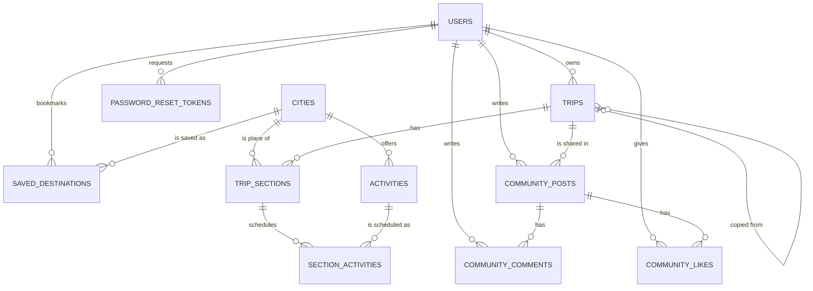

# GlobeTrotter — Product Requirements Document (Master)

> **This is the master reference for the GlobeTrotter project.** It consolidates and supersedes the four working design documents (`ARCHITECTURE.md`, `DATABASE.md`, `REST_API_Specification.md`, `UI_UX.md`) into one source of truth spanning product vision, requirements, data model, architecture, API, design system, and delivery plan. Where any subordinate document conflicts with this PRD, **this PRD wins**; where this PRD is silent, the subordinate documents apply.

---

## 0. Document Control

| Field | Value |
|---|---|
| Product | **GlobeTrotter** — personalized multi-city travel-planning platform |
| Context | Odoo Hackathon submission |
| Document | Product Requirements Document (master) |
| Version | 1.0 |
| Status | Baseline — implementation-ready |
| Date | 2026-08-22 |
| Owner | Saumya (project lead) |
| Canonical stack | **Python · FastAPI · SQLAlchemy 2.0 · Alembic · PostgreSQL 16** (backend); **React · TypeScript · Vite · Tailwind** (frontend) |
| Naming note | Product name is **GlobeTrotter** (brief/PDF title). The in-app logo/header reads **"GlobalTrotter"** per the wireframe. Same product. |

### 0.1 Canonical-source resolution (read this first)

The working documents were authored at different times and diverged. This PRD resolves the divergence explicitly:

- **Backend stack — FastAPI/Python is canonical.** `ARCHITECTURE.md`, `DATABASE.md`, and `REST_API_Specification.md` all target **FastAPI + SQLAlchemy + Alembic + PostgreSQL**. This is the design of record. The current `server/` code (Node.js/Express/Prisma) and `SCHEMA.md` describe an **early prototype** and are treated as **superseded**; the production build targets the FastAPI design in this PRD. See §19 (Risks & Open Decisions) for the migration note.
- **Data model — the Sections model is canonical.** `DATABASE.md` (which self-identifies as "the most important document") defines a **Sections-based** itinerary: `trips → trip_sections → section_activities`, plus a `community` subsystem. This supersedes the older **Stops-based** model (`trip_stops`, `trip_activities`, `expenses`, `shared_trips`) still referenced in `REST_API_Specification.md` and `SCHEMA.md`. All API endpoints in §12 are reconciled to the Sections model.
- **UX — the workspace model is canonical.** `UI_UX.md` §1–§53 (the product body) is authoritative for experience and design; its §54–§59 appendix is an illustrative implementation reference only and does not override the data model in §10.

### 0.2 How to use this document

Product/design readers: §1–§9, §13–§14, §17. Backend readers: §10–§12, §15. Frontend readers: §8–§9, §11 (frontend), §12–§14. Delivery/judging: §16–§18. Everyone: §0.1 and §19.

### 0.3 Requirement labels & priorities

Feature tags: **[SPEC]** required by the brief · **[UX+]** improved representation of a spec requirement · **[DIFF]** differentiator beyond the spec · **[OPT]** nice-to-have, build only if time remains.
Build priority: **P0** must work for the demo · **P1** important polish/intelligence · **P2** time-permitting.

---

## Table of Contents

1. Executive Summary
2. Problem & Opportunity
3. Product Vision & Principles
4. Goals, Non-Goals & Success Criteria
5. Target Users — Personas & Core Jobs
6. Scope — The 13 Screens & the Workspace Model
7. Information Architecture & Navigation
8. Functional Requirements
9. Data Model (Authoritative)
10. System Architecture
11. API Specification
12. Design System & UX Standards
13. Key User Flows
14. Non-Functional Requirements
15. Build Plan, Priorities & Deliverables
16. Demo Narrative & WOW Moments
17. Evaluation-Criteria Alignment
18. Risks & Open Decisions
19. Appendices

---

## 1. Executive Summary

GlobeTrotter is a **planning cockpit for travel** — not a form for entering trip data. Discovering a place, scheduling it, checking whether it fits the budget, and seeing the effect on trip quality are treated as **one continuous action loop**, inside a single persistent **Trip Workspace**, rather than four disconnected screens.

The product turns a multi-city trip into live, database-backed state: every number it shows — Trip Health score, budget remaining, day load — is computed from real data the user entered, and every recommendation states *why* it was made. It is built almost entirely on **our own code and our own PostgreSQL dataset**, with **no third-party maps/places/booking APIs**, which is both a hackathon constraint and a differentiator.

The core loop is:

```
DISCOVER → PLAN → VALIDATE → OPTIMIZE → SHARE
   │          │        │          │         │
 Discover  Itinerary  Health   Health fix  Share
   tab        tab      panel    applied     tab
```

Adding a destination or activity from **Discover** writes directly into the active trip's **Itinerary**; every itinerary edit recalculates **Budget** and **Trip Health** in the same render cycle; Trip Health surfaces an **Optimize** action inline; **Share** publishes a read-only public "trip story" that other users can **Copy** into their own account. That loop — not the screen count — is the product.

## 2. Problem & Opportunity

Planning a multi-city trip is fragmented across spreadsheets, map tabs, booking sites, and note apps. Travelers lose the thread between *what they want to do*, *what it costs*, and *whether the plan is actually realistic*. Existing planners either look good but stay dumb (no validation of pacing/budget), or are powerful but feel like separate tools bolted together.

The opportunity is a planner where **intelligence is deterministic, explainable, and live**: the app already knows the trip's dates, budget target, and scheduled hours, so it can tell the user "Day 4 is overloaded — move one activity to Day 5" and then *do it for them* — all without any ML or external service. Combined with a genuinely shareable public trip page and one-click **Copy Trip**, GlobeTrotter is both a personal tool and a light social/discovery surface.

## 3. Product Vision & Principles

**Vision.** One continuous workspace where discovery, planning, validation, budgeting, and sharing are views of the *same trip*, and where every computed value explains itself.

**Product principles:**

1. **One trip, one workspace.** Discover, Itinerary, Calendar, Budget, Health, and Share are views of the same trip, not separate apps. Selected trip and selected day persist across all of them.
2. **Show your work.** No unexplained scores, no unexplained recommendations, no fabricated statistics — anywhere, including Admin.
3. **Estimates are not expenses.** Planning is provisional; spending is a fact. The UI never conflates *planned* cost with *actual* expense.
4. **Deterministic intelligence, honestly labeled.** Trip Health and recommendations are rule-based (FastAPI + PostgreSQL). Nothing is called "AI" that isn't.
5. **Feedback for every action.** Save, delete, reorder, share — the user always knows what happened and how to undo it.
6. **Design with constraints, not around them.** Minimal external APIs; the product must work, look complete, and feel fast on our own dataset.
7. **Accessible by default, not by checklist.** Keyboard and screen-reader parity are designed alongside mouse/touch, not bolted on.

**Design language.** Editorial, confident, warm — a well-typeset travel magazine crossed with a flight-ops dashboard. Flat surfaces, deliberate whitespace, one accent color used for meaning. **Explicitly avoided:** purple/blue "AI" gradients, glassmorphism, decorative blobs, more than one card style per surface, animation without a state-change reason, invented statistics.

## 4. Goals, Non-Goals & Success Criteria

### 4.1 Goals

- Deliver the full DISCOVER→PLAN→VALIDATE→OPTIMIZE→SHARE loop end-to-end on real, database-backed data.
- Implement all **[SPEC]** screens from the brief (§6) with production-quality UX (empty/loading/error/success states, accessibility, responsive layouts).
- Ship a **normalized, integrity-enforced PostgreSQL schema** (§9) — the highest-weighted evaluation area.
- Provide **explainable, deterministic** Trip Health and recommendations (§8.9–8.10) as the primary differentiator.
- Ship a **public trip story + Copy Trip** flow that works end-to-end, including the signup detour.

### 4.2 Non-Goals (MVP)

- No third-party maps/places/booking/geocoding APIs, no external image service, no third-party auth as a required path. (Open-source *libraries* are fine — see §10.8.)
- No real-time multi-user co-editing of a trip (public read-only share + Copy Trip only).
- No native mobile apps (responsive web only).
- No payment/booking transactions — GlobeTrotter plans trips, it does not sell them.
- No ML models — all "intelligence" is rule-based and explained.

### 4.3 Success criteria

- A judge can log into a **pre-seeded demo account** and immediately see a meaningful multi-city trip with a deliberately overloaded day and an over-budget category, so Trip Health, Budget, and the Journey Visualization all render with real data.
- The 3–5 minute demo (§16) runs without dead ends: create → discover → build → validate → optimize → share → copy.
- Ownership/authorization holds: a user can never read or write another user's trip; admin routes are gated.
- Budget always reconciles from real itinerary + expense rows, with **planned and actual kept distinct**.

## 5. Target Users — Personas & Core Jobs

**Personas** (used as the named actors in the flows in §13):

- **Aditi, the Adventure Planner** (solo, 27, tech-savvy) — plans a multi-day hiking-plus-city trip; wants inspirational, *reasoned* recommendations and an itinerary builder that doesn't fight her. Primary surfaces: Discover, Itinerary Builder.
- **Rohan, the Family Traveler** (working parent, 35) — organizing a trip for spouse and child; prefers a guided flow, is budget-conscious, wants explicit warnings ("Day 4 has no activities"), often on mobile. Primary surfaces: Create Trip, Budget, Calendar, mobile Itinerary.
- **Sara, the Group Trip Organizer** (student, 22) — tight budget; relies on Public Share + Copy Trip so friends can duplicate her plan; needs efficient filtered search. Primary surfaces: Discover filters, Share, Copy Trip.

**Core user jobs:**

1. Start a trip and see it become a real workspace immediately (not a blank form).
2. Find cities and activities that fit interests and budget, **with a stated reason**.
3. Build a day-by-day schedule without fighting the interface.
4. Know, at a glance, whether the trip is realistic (time, budget, pacing).
5. Fix problems the product has already found for them.
6. Share a trip that looks worth sharing — and let others copy it.

## 6. Scope — The 13 Screens & the Workspace Model

All 13 screens from the brief are preserved. City Search and Activity Search are surfaced under a friendlier **Discover** label but retain every required capability. The itinerary screens are unified into the persistent **Trip Workspace** rather than living as separate top-level pages.

| # | Brief screen | Where it lives in GlobeTrotter | Priority |
|---|---|---|---|
| 1 | Login / Signup | Auth flow (§8.1) | P0 |
| 2 | Dashboard / Home | Dashboard (§8.2) | P0 |
| 3 | Create Trip | Create Trip flow (§8.3) | P0 |
| 4 | My Trips | My Trips (§8.4) | P0 |
| 5 | Itinerary Builder | Trip Workspace → Itinerary (§8.6) | P0 |
| 6 | Itinerary View | Trip Workspace → Overview + view-mode toggle in Itinerary (§8.6) | P0 |
| 7 | City Search | Trip Workspace → Discover (§8.5) | P0 |
| 8 | Activity Search | Discover → Activities tab (§8.5) | P0 |
| 9 | Trip Budget & Cost Breakdown | Trip Workspace → Budget (§8.8) | P0 |
| 10 | Trip Calendar / Timeline | Trip Workspace → Calendar (§8.7) | P0 |
| 11 | Shared / Public Itinerary | Public Trip Story page (§8.11) | P0 |
| 12 | User Profile / Settings | Profile & Settings (§8.13) | P0 |
| 13 | Admin / Analytics (optional) | Admin (§8.14) | P2 |

The **Community** feed (posts/likes/comments over public trips) is present in the data model and API and surfaced as an additional social surface (§8.12).

### 6.1 The Trip Workspace model (architectural core)

One persistent trip-context object — `{ trip id, name, dates, currency, budget target }` — is held in a shared client store and read by every workspace tab. Switching tabs never re-fetches trip identity, only tab-specific data. Tabs, always in this order, always with the trip name + date range in a slim header: **Overview · Itinerary · Discover · Calendar · Budget · Health · Share**. This context permanence is the win: trip identity stays visible during Calendar/Budget/Health switches, which flat top-tabs would lose on scroll.

## 7. Information Architecture & Navigation

```
/
├── Landing
├── Login  ·  Signup  ·  Forgot Password
│
├── App (authenticated)
│   ├── Dashboard
│   ├── Discover                       (global, trip-agnostic browse)
│   ├── My Trips
│   │   └── Trip Workspace/{tripId}
│   │       ├── Overview
│   │       ├── Itinerary
│   │       ├── Discover                (trip-scoped: "add to THIS trip")
│   │       ├── Calendar
│   │       ├── Budget
│   │       ├── Health
│   │       └── Share
│   ├── Community
│   ├── Saved
│   ├── Profile
│   └── Settings
│
├── /t/{shareSlug}                      (Public Trip Story — no auth)
└── /admin                              (optional, role-gated)
```

**Discover has two contexts, one implementation.** A global entry point (Dashboard → "Discover", no trip selected → prompts "Add to a trip" via a trip picker) and a trip-scoped tab inside Trip Workspace (adds directly to the open trip). Same component, different context prop — do not build two Discover implementations.

**Navigation by breakpoint:**

| Aspect | Mobile (<640px) | Tablet (640–1024px) | Desktop (>1024px) |
|---|---|---|---|
| Chrome | Bottom tab bar (5 items) + overflow sheet | Icon-only rail + horizontal sub-nav | Full left rail + nested trip sub-nav |
| Trip sub-nav | Horizontal scrollable tab strip | Pinned tab strip under trip header | Nested under active-trip card in rail |

The active-trip section renders in the left rail **only once a trip is opened**, nested under a small trip-name header with a "← All Trips" back affordance, reinforcing "you are inside one workspace."

## 8. Functional Requirements

Each feature lists its tag, priority, and testable requirements. "The system must…" statements are acceptance-checkable.

### 8.1 Authentication — [SPEC] · P0

Login is by **username + password** (per the wireframe, Screen 1); registration collects the full profile (Screen 2).

- The system must support **register**, **login**, **logout**, and **forgot/reset password**.
- Registration fields: first name, last name, username, email, password, confirm password, and terms acceptance; optional profile fields (phone, city, country, additional info, avatar) may be captured here or later in Profile.
- Passwords must be hashed with **bcrypt**; plaintext is never stored, logged, or returned.
- Login issues a short-lived **access JWT** and a longer-lived **refresh JWT**; session persists via token refresh and survives reload.
- Auth states: idle → validating (inline, on blur) → submitting (button spinner, disabled) → success (redirect to Dashboard + one-time welcome toast) → error. Field errors are inline; server/auth errors show a single InlineAlert ("Incorrect username or password," never a generic "Error occurred").
- Forgot Password is a **two-step** flow (enter email → "Check your inbox" confirmation) and must **not reveal whether the email exists**. Reset tokens are stored hashed, single-use, and expiring.
- Expired session redirects to Login with "Your session expired — log back in to continue," and returns the user to the prior route after re-auth.
- No social/GitHub login is a required or default path in v1; if added later it appears as a clearly secondary option below the email/password form.

### 8.2 Dashboard / Home — [SPEC, UX+] · P0

Answers "what do I need to know about my travel," not a generic admin dashboard. Renders: greeting; **Your next trip** (name, days-until, destination sequence, readiness %, spent-estimate vs budget target, day/city/activity counts, "Continue Planning"); **Needs your attention** (only *true* alerts — overloaded day, over-budget, empty day; if healthy, a single positive line); **Discover something new** (3–4 DestinationCards with per-card reasoning).

- All numbers must be computed from the user's real trip data. No placeholder warnings ever.
- With no trips, the whole block is replaced by the empty state ("Your next adventure starts here." → Plan your first trip).

### 8.3 Create Trip — [SPEC, UX+] · P0

- Required: trip **name**, **start date**, **end date**, **description**, cover image (optional upload; curated fallback keyed by region/category if skipped).
- Optional: **budget target**, **currency**, **travel style** (Adventure/Relaxation/Backpacking/Luxury/Family/Cultural/Food/Nature/Road Trip), **interest tags** (feed "For You" reasoning in Discover).
- The date picker must block `end < start` and show trip length live ("7 days").
- On Save, the trip is created and the user lands **directly in its Trip Workspace Overview** — not back to My Trips.

### 8.4 My Trips — [SPEC] · P0

- Trip cards show: cover image, title, date range, destination count, activity count, budget summary, progress bar, status badge.
- Statuses are **computed, not manually set**: *Planning · Ready · Upcoming · Active · Completed* (from dates + readiness). The date-derived grouping (upcoming/ongoing/completed) drives the My Trips tabs and the Calendar.
- Card actions: View, Edit, Duplicate, Share, Delete (Delete requires typed confirmation — see §12.7).
- Toolbar: search, sort (recent/date/name), filter by status. Product-voiced empty state.

### 8.5 Discover — City & Activity Search — [SPEC] · P0

Satisfies brief Screens 7 and 8 as one connected surface.

- **Destination search:** debounced (300ms) search over the seeded `cities` catalog; filters for Country, Region, Cost index, Popularity; quick pills (Popular · For You · Budget Friendly · Adventure · Nature · Culture · Food).
- DestinationCards show city/country, cost-index band (₹/day), popularity indicator, and **"Add to Trip"** (opens trip-picker if no trip active; adds directly inside a Trip Workspace).
- Selecting a destination opens a detail panel with an **Activities tab**: filter by category (Adventure/Nature/Culture/Food/Sightseeing/Shopping/Nightlife/Relaxation), cost, duration, difficulty. Each ActivityCard shows description, image, cost, duration, and an add/remove toggle reflecting current trip membership.
- Must expose loading skeletons and a product-voiced empty search state.

### 8.6 Itinerary Builder — [SPEC, hero surface] · P0

The **Section** is the core building block: per the wireframe, "anything — a travel leg, a hotel, or an activity," each with its own **date range** and **budget**, optionally tied to a city. Sections are ordered (`sequence_order`) and hold day-wise **section activities**.

Three-pane desktop layout: **Days** (left) · **Itinerary** (center) · **Insights** (right: Trip Health + Budget remaining + Suggestions).

- **Add/edit/remove** sections and section-activities; inline edit of time, cost, and note; per-item estimated cost.
- **Drag-and-drop** reorder within a day and across days, with an insertion-line indicator; a drop is rejected (springs back) only if it would fall outside the trip's date range.
- **Keyboard path (required, not degraded):** focus item → `Space` grabs ("Grabbed. Use arrow keys to move, Space to drop" via live region) → arrows move within/across days → `Space` drops, `Esc` cancels. Same mutation as the "Move to…" dialog.
- **Touch:** long-press (150ms) to pick up, lifted-shadow drag, edge auto-scroll.
- **View-mode toggle** (satisfies "Itinerary View"): segmented control switches the center pane between the day-by-day builder and a compact read-only grouped-by-city list for pre-share review.
- **States:** hover, selected (brand left border), edit, deletion (200ms collapse + 6s UndoToast), loading (skeleton rows), per-day empty ("This day still has room for something memorable." → Explore activities), inline error with retry.
- **Autosave + conflict handling:** every edit autosaves per §12.6; on a version mismatch (edited elsewhere), show "This day changed elsewhere — reload to see the latest." **Last-write-wins is explicitly rejected** for itinerary data.

### 8.7 Calendar / Timeline — [SPEC] · P0

A vertical timeline grouped by day (expandable/collapsible), showing time-blocked activities with cost and city-context headers when the trip spans multiple stops ("KYOTO — Day 3 of 3"). Drag-to-reorder here uses the **identical mutation** as the Itinerary Builder — a different lens on the same data, not a separate model. Inline quick-edit (tap a block → time/cost) without leaving the timeline. Also supports a month view of all the user's trips.

### 8.8 Budget & Cost Breakdown — [SPEC, UX+] · P0

Distinguishes **Planned/Estimated** from **Actual Expense** explicitly — separate fields per item and separate rollups at trip level. Never a single merged "spent."

- Show **Planned** (of target), **Actual so far** (entered expenses only), and **Variance** (only if actuals exist).
- **By-category** breakdown (Transport, Stay/Accommodation, Activities, Food, Misc) using the category mapping in §9.6.
- **Daily breakdown** with the highest-cost day and any **over-budget days** flagged.
- Actual amounts render in `--foreground`, planned in `--foreground-muted`, both always labeled with their kind — never bare numbers. If no actuals are logged, omit the Actual/Variance rows (do not show ₹0).
- One contextual insight line beneath the chart ("Day 4 is your most expensive day at ₹6,200" / "You're ₹7,400 under target — nice work").
- Charts must have an accessible "View as table" equivalent (§12.5).

### 8.9 Trip Health — [DIFF, first-class] · P1

A deterministic 0–100 score with five sub-scores, computed in FastAPI from real trip data (no ML, no external call):

- **Budget** — planned total vs. target, penalized for over-budget days.
- **Schedule balance** — variance in scheduled hours/day; flags a day >9h scheduled or with >2h gaps.
- **Destination flow** — order/geographic sanity; flags backtracking between stops without a transport section logged.
- **Activity density** — activities-per-day vs. a reasonable band for the trip's pace/style.
- **Completeness** — % of days with ≥1 activity and required trip fields filled.

Each sub-score is clickable and expands to the **exact rule and offending item** (e.g., "Day 4 contains 10.5 hours of scheduled activities. Move one activity to Day 5 to improve schedule balance.") with a **[ Move it for me ]** one-click fix that opens the Move dialog pre-filled with the suggested target day. The score and sub-scores recalculate live (count-up animation) whenever the itinerary or budget changes. This is the "Optimize" step of the core loop made concrete.

### 8.10 Recommendations — [DIFF] · P1/P2

Never a bare "Recommended for you." Every recommendation carries one explicit reason from the strongest matching signal, computed from stored data (interest tags, remaining budget, open time blocks) — deterministic, not a black box:

- "Recommended because you like {interest tags}"
- "Fits your budget — est. ₹{x}, your target is ₹{y}/day"
- "Good fit for Day {n} — {duration} currently open"

### 8.11 Public Sharing & Copy Trip — [SPEC] · P0

- A trip becomes public via `is_public` + a unique, human-readable `public_slug` served at `/t/{slug}` (never a raw ID).
- The public **Trip Story** page is read-only: journey-visualization header, day-by-day summary, cover imagery, trip stats (dates, cities, days). **No budget figures unless the owner opts in, and never actual-expense data** even if opted in (planned totals only).
- Actions: **Copy Trip** (deep-clones the full itinerary into the viewer's account, prompting signup/login first if needed) and social share (native sheet on mobile, copy-link on desktop).
- Privacy must be enforced **server-side**, not just hidden client-side. Copy Trip records lineage via `copied_from_trip_id`.

### 8.12 Community — [SPEC-adjacent] · P1

A feed of shared experiences (`community_posts`) about a trip or activity, with likes and comments.

- Create/read posts (title, body, optional image, optional linked trip); like/unlike (one like per user, enforced by unique constraint); comment.
- Feed sortable by recent (`created_at`) or popular (`like_count`, a maintained counter cache).
- Deleting a linked trip keeps the post (sets `trip_id` null); deleting a post cascades its comments/likes.

### 8.13 Profile & Settings — [SPEC] · P0

- Required: name, photo, email, language, **saved destinations** list, **delete account** (destructive).
- Added: currency, default travel-style preference, notification preferences, accessibility preferences (reduced-motion toggle mirroring `prefers-reduced-motion`, high-contrast toggle).
- Account deletion is **soft-delete** at the data layer (§9.4) and a **two-step typed confirmation** at the UI layer.

### 8.14 Admin / Analytics — [OPT, per brief] · P2

Build only if time remains. Tables/charts of trips-created-over-time, top cities, top activities, engagement stats, and basic user management. **All charts pull from real Postgres aggregates** — no fabricated numbers even as placeholder; use "No data yet" empty states instead. Gated by `is_admin`.

## 9. Data Model (Authoritative)

> This is the canonical schema — the **Sections-based** model from `DATABASE.md`. **Engine:** PostgreSQL 16 (self-hosted, no BaaS). **Access:** SQLAlchemy 2.0 ORM, versioned with Alembic. Fully normalized (3NF), integrity enforced by real constraints, indexed for the app's actual queries. It supersedes the older Stops-based model in `REST_API_Specification.md`/`SCHEMA.md`.

### 9.1 Conceptual model

A **User** (full profile) owns many **Trips**. A Trip is an ordered list of **Sections** — a Section is *anything* (a travel leg, a hotel, or an activity), each with its own **date range** and **budget**, optionally tied to a **City**. Each Section holds day-wise **Section Activities** (the "Physical Activity + Expense" rows), drawn from a searchable **Activities** catalog. Users share trips on a **Community** feed (posts, likes, comments) and can make trips **public** (shareable link + Copy Trip). Trip status (Ongoing / Upcoming / Completed) is **derived from dates**, never stored.

### 9.2 Entity–Relationship Diagram



**Entities:** `users`, `cities`, `activities`, `trips`, `trip_sections`, `section_activities`, `community_posts`, `community_comments`, `community_likes`, `saved_destinations`, `password_reset_tokens`.

### 9.3 Table specifications

Legend: **PK** primary key · **FK** foreign key · **UK** unique · **NN** not null.

**`users`** *(Screens 1–2)* — login by username+password; full profile from registration; bcrypt hash; soft delete.
`id` PK · `username` citext UK NN · `email` citext UK NN · `password_hash` varchar(255) NN · `first_name` varchar(80) NN · `last_name` varchar(80) NN · `phone_number` varchar(20) · `city` varchar(120) · `country` varchar(120) · `additional_info` text · `avatar_url` varchar(500) · `language_pref` varchar(10) NN default `'en'` · `is_admin` boolean NN default false · `created_at`/`updated_at`/`deleted_at` timestamptz.
Constraint: `CHECK (phone_number ~ '^[0-9+\-() ]{7,20}$')` when present.

**`cities`** (reference, seeded) *(Screens 3, 4, 8)* — master list users search and select a place from.
`id` PK · `name` varchar(120) NN · `country` varchar(120) NN · `region` varchar(120) · `latitude`/`longitude` numeric(9,6) · `cost_index` numeric(6,2) NN default 100 · `popularity_score` int NN default 0 · `image_url` varchar(500) · `description` text.
Constraint: `UNIQUE (name, country)`.

**`activities`** (reference, seeded) *(Screen 8)* — searchable catalog scoped to a city.
`id` PK · `city_id` FK→cities NN · `name` varchar(160) NN · `category` varchar(40) NN (`sightseeing`/`food`/`adventure`/`culture`/`nightlife`/`relaxation`) · `description` text · `estimated_cost` numeric(10,2) NN default 0 · `duration_minutes` int · `image_url` varchar(500).
Constraint: `CHECK (estimated_cost >= 0)`.

**`trips`** *(Screens 3,4,6,7,11)* — the plan. Status derived from dates. `public_slug` powers the share link; `copied_from_trip_id` records Copy Trip lineage.
`id` PK · `user_id` FK→users NN · `name` varchar(160) NN · `description` text · `start_date` date NN · `end_date` date NN · `cover_photo_url` varchar(500) · `total_budget` numeric(12,2) · `currency` varchar(3) NN default `'INR'` · `is_public` boolean NN default false · `public_slug` varchar(16) UK nullable · `copied_from_trip_id` FK→trips nullable · `created_at`/`updated_at` timestamptz.
Constraints: `CHECK (end_date >= start_date)`, `CHECK (total_budget IS NULL OR total_budget >= 0)`.

**`trip_sections`** *(Screen 5 — core building block)* — "anything: a travel leg, hotel, or activity," with a date range and budget; ordered; optionally tied to a city.
`id` PK · `trip_id` FK→trips **ON DELETE CASCADE** NN · `title` varchar(160) NN · `description` text · `section_type` varchar(20) NN (`transport`/`accommodation`/`activity`/`food`/`sightseeing`/`other`) · `city_id` FK→cities nullable · `start_date` date NN · `end_date` date NN · `budget` numeric(12,2) NN default 0 · `sequence_order` int NN · `notes` text.
Constraints: `CHECK (end_date >= start_date)`, `CHECK (budget >= 0)`, `UNIQUE (trip_id, sequence_order)` (deferrable for reorders). `section_type` maps directly to budget categories.

**`section_activities`** *(Screen 9 — day-wise "Physical Activity" + "Expense")* — a day-scheduled item: catalog `activity_id` OR a `custom_name`.
`id` PK · `trip_section_id` FK→trip_sections **ON DELETE CASCADE** NN · `activity_id` FK→activities nullable · `custom_name` varchar(160) nullable · `scheduled_date` date NN · `scheduled_time` time · `sequence_order` int NN · `expense` numeric(10,2) NN default 0 · `notes` text.
Constraints: `CHECK (activity_id IS NOT NULL OR custom_name IS NOT NULL)`, `CHECK (expense >= 0)`. `expense` is a deliberate **price snapshot** protecting saved itineraries from later catalog edits.

**`community_posts`** *(Screen 10)* — `id` PK · `user_id` FK→users CASCADE NN · `trip_id` FK→trips **ON DELETE SET NULL** nullable · `title` varchar(200) NN · `body` text NN · `image_url` varchar(500) · `like_count` int NN default 0 (denormalized counter) · `created_at`/`updated_at`.

**`community_comments`** — `id`, `post_id` (FK CASCADE), `user_id` (FK CASCADE), `body` NN, `created_at`.
**`community_likes`** — `id`, `post_id` (FK CASCADE), `user_id` (FK CASCADE), `created_at`, **`UNIQUE (post_id, user_id)`** (one like per user).
**`saved_destinations`** — `id`, `user_id` (FK CASCADE), `city_id` (FK CASCADE), `created_at`, `UNIQUE (user_id, city_id)`.
**`password_reset_tokens`** — `id`, `user_id` (FK CASCADE), `token_hash` NN, `expires_at` NN, `used_at` nullable (single-use).

### 9.4 Referential integrity & cascade rules

| Relationship | On delete | Reasoning |
|---|---|---|
| trip → trip_sections | **CASCADE** | delete trip → delete its sections |
| trip_section → section_activities | **CASCADE** | delete section → delete its scheduled items |
| trip → community_posts (`trip_id`) | **SET NULL** | keep the shared experience even if the trip is deleted |
| community_post → comments/likes | **CASCADE** | engagement belongs to the post |
| user → trips | **RESTRICT** (soft-delete user) | preserve history/analytics |
| city / activity → trip_* | **RESTRICT** | reference data can't vanish while in use |

### 9.5 Indexing strategy (tuned to real queries)

`UNIQUE(username)`, `UNIQUE(email)` (users) · `idx_trips_user_dates (user_id, start_date)` · `UNIQUE(public_slug)` · `idx_sections_trip_order (trip_id, sequence_order)` · `idx_sections_type (trip_id, section_type)` · `idx_secact_section_day_order (trip_section_id, scheduled_date, sequence_order)` · `idx_activities_city_cat (city_id, category)` · `idx_cities_region_pop (region, popularity_score desc)` · **GIN trigram** on `cities.name` and `activities.name` for fuzzy `ILIKE` (`pg_trgm`) · `idx_posts_created (created_at desc)`, `idx_posts_likes (like_count desc)` · `UNIQUE(post_id, user_id)` (likes).

### 9.6 Budget aggregation — the exact formula

Two budget views, both sourced deterministically (computed once in `services/budget.py`, single-sourced and testable):

**Planned (Screen 5)** — from each section's `budget`:
```
Planned total  = trips.total_budget  (if set)  else  Σ trip_sections.budget
Planned by cat = Σ trip_sections.budget  GROUP BY section_type
```
**Actual (Screen 9)** — from itemized activity expenses:
```
Actual total   = Σ section_activities.expense
Actual by cat  = Σ section_activities.expense (joined to section) GROUP BY section.section_type
Avg / day      = Actual total / (end_date − start_date + 1)
```
**Category mapping** (matches the brief's transport/stay/activities/meals): `transport → transport`, `stay → accommodation`, `activities → activity + sightseeing`, `meals → food`, plus `other`.
**Over-budget alerts:** per section, flag when `Σ its section_activities.expense > section.budget`; per day, flag when a day's total `> total_budget / num_days`.

### 9.7 Normalization & deliberate denormalizations

- **3NF throughout** — city/activity facts live once in reference tables, referenced by FK.
- **Generalized Sections** replace rigid city-stops, matching the wireframe; `section_type` drives budget categories without extra columns.
- Documented denormalizations: **`section_activities.expense`** (price snapshot) and **`community_posts.like_count`** (counter cache kept in sync in `services/community.py`).
- **Explicit ordering** (`sequence_order`) supports drag-to-reorder for sections and day activities.

### 9.8 Seed strategy (real, dynamic data — never static JSON in the app)

`cities` and `activities` are seeded once from `backend/app/seeds/` into PostgreSQL (~40–60 real cities across regions, each with 4–8 activities across categories, with real `cost_index`/`popularity_score`). Plus **one fully-built demo trip** (multi-city, multiple days, a deliberately overloaded day, a deliberately over-budget category) under a pre-built demo account, and at least one public trip so Community renders immediately. At runtime the app reads all of this **from the DB via the API** — the front end never bundles static JSON. This satisfies the "dynamic data, not static JSON" constraint while avoiding external APIs.

<!-- BUILD-CURSOR -->
