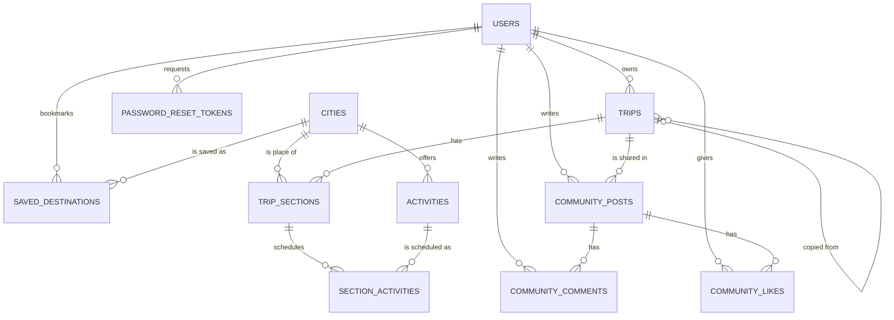
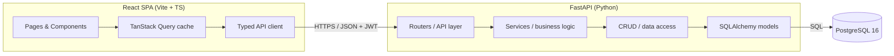

# GlobeTrotter — Product Requirements Document (Master)

> **This is the master reference for the GlobeTrotter project.** It consolidates and supersedes the four working design documents (`ARCHITECTURE.md`, `DATABASE.md`, `REST_API_Specification.md`, `UI_UX.md`) into one source of truth spanning product vision, requirements, data model, architecture, API, design system, and delivery plan. Where any subordinate document conflicts with this PRD, **this PRD wins**; where this PRD is silent, the subordinate documents apply.

---

## 0. Document Control

| Field | Value |
|---|---|
| Product | **GlobeTrotter** — personalized multi-city travel-planning platform |
| Context | Odoo Hackathon submission |
| Document | Product Requirements Document (master) |
| Version | 1.0 |
| Status | Baseline — implementation-ready |
| Date | 2026-08-22 |
| Owner | Saumya (project lead) |
| Canonical stack | **Python · FastAPI · SQLAlchemy 2.0 · Alembic · PostgreSQL 16** (backend); **React · TypeScript · Vite · Tailwind** (frontend) |
| Naming note | Product name is **GlobeTrotter** (brief/PDF title). The in-app logo/header reads **"GlobalTrotter"** per the wireframe. Same product. |

### 0.1 Canonical-source resolution (read this first)

The working documents were authored at different times and diverged. This PRD resolves the divergence explicitly:

- **Backend stack — FastAPI/Python is canonical.** `ARCHITECTURE.md`, `DATABASE.md`, and `REST_API_Specification.md` all target **FastAPI + SQLAlchemy + Alembic + PostgreSQL**. This is the design of record. The current `server/` code (Node.js/Express/Prisma) and `SCHEMA.md` describe an **early prototype** and are treated as **superseded**; the production build targets the FastAPI design in this PRD. See §19 (Risks & Open Decisions) for the migration note.
- **Data model — the Sections model is canonical.** `DATABASE.md` (which self-identifies as "the most important document") defines a **Sections-based** itinerary: `trips → trip_sections → section_activities`, plus a `community` subsystem. This supersedes the older **Stops-based** model (`trip_stops`, `trip_activities`, `expenses`, `shared_trips`) still referenced in `REST_API_Specification.md` and `SCHEMA.md`. All API endpoints in §11 are reconciled to the Sections model.
- **UX — the workspace model is canonical.** `UI_UX.md` §1–§53 (the product body) is authoritative for experience and design; its §54–§59 appendix is an illustrative implementation reference only and does not override the data model in §10.

### 0.2 How to use this document

Product/design readers: §1–§9, §12–§13, §16–§17. Backend readers: §9–§11, §14–§15. Frontend readers: §7–§9, §10.2 (frontend), §11–§13. Delivery/judging: §15–§18. Everyone: §0.1 and §19.

### 0.3 Requirement labels & priorities

Feature tags: **[SPEC]** required by the brief · **[UX+]** improved representation of a spec requirement · **[DIFF]** differentiator beyond the spec · **[OPT]** nice-to-have, build only if time remains.
Build priority: **P0** must work for the demo · **P1** important polish/intelligence · **P2** time-permitting.

---

## Table of Contents

1. Executive Summary
2. Problem & Opportunity
3. Product Vision & Principles
4. Goals, Non-Goals & Success Criteria
5. Target Users — Personas & Core Jobs
6. Scope — The 13 Screens & the Workspace Model
7. Information Architecture & Navigation
8. Functional Requirements
9. Data Model (Authoritative)
10. System Architecture
11. API Specification
12. Design System & UX Standards
13. Key User Flows
14. Non-Functional Requirements
15. Build Plan, Priorities & Deliverables
16. Demo Narrative & WOW Moments
17. Evaluation-Criteria Alignment
18. Risks & Open Decisions
19. Appendices

---

## 1. Executive Summary

GlobeTrotter is a **planning cockpit for travel** — not a form for entering trip data. Discovering a place, scheduling it, checking whether it fits the budget, and seeing the effect on trip quality are treated as **one continuous action loop**, inside a single persistent **Trip Workspace**, rather than four disconnected screens.

The product turns a multi-city trip into live, database-backed state: every number it shows — Trip Health score, budget remaining, day load — is computed from real data the user entered, and every recommendation states *why* it was made. It is built almost entirely on **our own code and our own PostgreSQL dataset**, with **no third-party maps/places/booking APIs**, which is both a hackathon constraint and a differentiator.

The core loop is:

```
DISCOVER → PLAN → VALIDATE → OPTIMIZE → SHARE
   │          │        │          │         │
 Discover  Itinerary  Health   Health fix  Share
   tab        tab      panel    applied     tab
```

Adding a destination or activity from **Discover** writes directly into the active trip's **Itinerary**; every itinerary edit recalculates **Budget** and **Trip Health** in the same render cycle; Trip Health surfaces an **Optimize** action inline; **Share** publishes a read-only public "trip story" that other users can **Copy** into their own account. That loop — not the screen count — is the product.

## 2. Problem & Opportunity

Planning a multi-city trip is fragmented across spreadsheets, map tabs, booking sites, and note apps. Travelers lose the thread between *what they want to do*, *what it costs*, and *whether the plan is actually realistic*. Existing planners either look good but stay dumb (no validation of pacing/budget), or are powerful but feel like separate tools bolted together.

The opportunity is a planner where **intelligence is deterministic, explainable, and live**: the app already knows the trip's dates, budget target, and scheduled hours, so it can tell the user "Day 4 is overloaded — move one activity to Day 5" and then *do it for them* — all without any ML or external service. Combined with a genuinely shareable public trip page and one-click **Copy Trip**, GlobeTrotter is both a personal tool and a light social/discovery surface.

## 3. Product Vision & Principles

**Vision.** One continuous workspace where discovery, planning, validation, budgeting, and sharing are views of the *same trip*, and where every computed value explains itself.

**Product principles:**

1. **One trip, one workspace.** Discover, Itinerary, Calendar, Budget, Health, and Share are views of the same trip, not separate apps. Selected trip and selected day persist across all of them.
2. **Show your work.** No unexplained scores, no unexplained recommendations, no fabricated statistics — anywhere, including Admin.
3. **Estimates are not expenses.** Planning is provisional; spending is a fact. The UI never conflates *planned* cost with *actual* expense.
4. **Deterministic intelligence, honestly labeled.** Trip Health and recommendations are rule-based (FastAPI + PostgreSQL). Nothing is called "AI" that isn't.
5. **Feedback for every action.** Save, delete, reorder, share — the user always knows what happened and how to undo it.
6. **Design with constraints, not around them.** Minimal external APIs; the product must work, look complete, and feel fast on our own dataset.
7. **Accessible by default, not by checklist.** Keyboard and screen-reader parity are designed alongside mouse/touch, not bolted on.

**Design language.** Editorial, confident, warm — a well-typeset travel magazine crossed with a flight-ops dashboard. Flat surfaces, deliberate whitespace, one accent color used for meaning. **Explicitly avoided:** purple/blue "AI" gradients, glassmorphism, decorative blobs, more than one card style per surface, animation without a state-change reason, invented statistics.

## 4. Goals, Non-Goals & Success Criteria

### 4.1 Goals

- Deliver the full DISCOVER→PLAN→VALIDATE→OPTIMIZE→SHARE loop end-to-end on real, database-backed data.
- Implement all **[SPEC]** screens from the brief (§6) with production-quality UX (empty/loading/error/success states, accessibility, responsive layouts).
- Ship a **normalized, integrity-enforced PostgreSQL schema** (§9) — the highest-weighted evaluation area.
- Provide **explainable, deterministic** Trip Health and recommendations (§8.9–8.10) as the primary differentiator.
- Ship a **public trip story + Copy Trip** flow that works end-to-end, including the signup detour.

### 4.2 Non-Goals (MVP)

- No third-party maps/places/booking/geocoding APIs, no external image service, no third-party auth as a required path. (Open-source *libraries* are fine — see §10.8.)
- No real-time multi-user co-editing of a trip (public read-only share + Copy Trip only).
- No native mobile apps (responsive web only).
- No payment/booking transactions — GlobeTrotter plans trips, it does not sell them.
- No ML models — all "intelligence" is rule-based and explained.

### 4.3 Success criteria

- A judge can log into a **pre-seeded demo account** and immediately see a meaningful multi-city trip with a deliberately overloaded day and an over-budget category, so Trip Health, Budget, and the Journey Visualization all render with real data.
- The 3–5 minute demo (§16) runs without dead ends: create → discover → build → validate → optimize → share → copy.
- Ownership/authorization holds: a user can never read or write another user's trip; admin routes are gated.
- Budget always reconciles from real itinerary + expense rows, with **planned and actual kept distinct**.

## 5. Target Users — Personas & Core Jobs

**Personas** (used as the named actors in the flows in §13):

- **Aditi, the Adventure Planner** (solo, 27, tech-savvy) — plans a multi-day hiking-plus-city trip; wants inspirational, *reasoned* recommendations and an itinerary builder that doesn't fight her. Primary surfaces: Discover, Itinerary Builder.
- **Rohan, the Family Traveler** (working parent, 35) — organizing a trip for spouse and child; prefers a guided flow, is budget-conscious, wants explicit warnings ("Day 4 has no activities"), often on mobile. Primary surfaces: Create Trip, Budget, Calendar, mobile Itinerary.
- **Sara, the Group Trip Organizer** (student, 22) — tight budget; relies on Public Share + Copy Trip so friends can duplicate her plan; needs efficient filtered search. Primary surfaces: Discover filters, Share, Copy Trip.

**Core user jobs:**

1. Start a trip and see it become a real workspace immediately (not a blank form).
2. Find cities and activities that fit interests and budget, **with a stated reason**.
3. Build a day-by-day schedule without fighting the interface.
4. Know, at a glance, whether the trip is realistic (time, budget, pacing).
5. Fix problems the product has already found for them.
6. Share a trip that looks worth sharing — and let others copy it.

## 6. Scope — The 13 Screens & the Workspace Model

All 13 screens from the brief are preserved. City Search and Activity Search are surfaced under a friendlier **Discover** label but retain every required capability. The itinerary screens are unified into the persistent **Trip Workspace** rather than living as separate top-level pages.

| # | Brief screen | Where it lives in GlobeTrotter | Priority |
|---|---|---|---|
| 1 | Login / Signup | Auth flow (§8.1) | P0 |
| 2 | Dashboard / Home | Dashboard (§8.2) | P0 |
| 3 | Create Trip | Create Trip flow (§8.3) | P0 |
| 4 | My Trips | My Trips (§8.4) | P0 |
| 5 | Itinerary Builder | Trip Workspace → Itinerary (§8.6) | P0 |
| 6 | Itinerary View | Trip Workspace → Overview + view-mode toggle in Itinerary (§8.6) | P0 |
| 7 | City Search | Trip Workspace → Discover (§8.5) | P0 |
| 8 | Activity Search | Discover → Activities tab (§8.5) | P0 |
| 9 | Trip Budget & Cost Breakdown | Trip Workspace → Budget (§8.8) | P0 |
| 10 | Trip Calendar / Timeline | Trip Workspace → Calendar (§8.7) | P0 |
| 11 | Shared / Public Itinerary | Public Trip Story page (§8.11) | P0 |
| 12 | User Profile / Settings | Profile & Settings (§8.13) | P0 |
| 13 | Admin / Analytics (optional) | Admin (§8.14) | P2 |

The **Community** feed (posts/likes/comments over public trips) is present in the data model and API and surfaced as an additional social surface (§8.12).

### 6.1 The Trip Workspace model (architectural core)

One persistent trip-context object — `{ trip id, name, dates, currency, budget target }` — is held in a shared client store and read by every workspace tab. Switching tabs never re-fetches trip identity, only tab-specific data. Tabs, always in this order, always with the trip name + date range in a slim header: **Overview · Itinerary · Discover · Calendar · Budget · Health · Share**. This context permanence is the win: trip identity stays visible during Calendar/Budget/Health switches, which flat top-tabs would lose on scroll.

## 7. Information Architecture & Navigation

```
/
├── Landing
├── Login  ·  Signup  ·  Forgot Password
│
├── App (authenticated)
│   ├── Dashboard
│   ├── Discover                       (global, trip-agnostic browse)
│   ├── My Trips
│   │   └── Trip Workspace/{tripId}
│   │       ├── Overview
│   │       ├── Itinerary
│   │       ├── Discover                (trip-scoped: "add to THIS trip")
│   │       ├── Calendar
│   │       ├── Budget
│   │       ├── Health
│   │       └── Share
│   ├── Community
│   ├── Saved
│   ├── Profile
│   └── Settings
│
├── /t/{shareSlug}                      (Public Trip Story — no auth)
└── /admin                              (optional, role-gated)
```

**Discover has two contexts, one implementation.** A global entry point (Dashboard → "Discover", no trip selected → prompts "Add to a trip" via a trip picker) and a trip-scoped tab inside Trip Workspace (adds directly to the open trip). Same component, different context prop — do not build two Discover implementations.

**Navigation by breakpoint:**

| Aspect | Mobile (<640px) | Tablet (640–1024px) | Desktop (>1024px) |
|---|---|---|---|
| Chrome | Bottom tab bar (5 items) + overflow sheet | Icon-only rail + horizontal sub-nav | Full left rail + nested trip sub-nav |
| Trip sub-nav | Horizontal scrollable tab strip | Pinned tab strip under trip header | Nested under active-trip card in rail |

The active-trip section renders in the left rail **only once a trip is opened**, nested under a small trip-name header with a "← All Trips" back affordance, reinforcing "you are inside one workspace."

## 8. Functional Requirements

Each feature lists its tag, priority, and testable requirements. "The system must…" statements are acceptance-checkable.

### 8.1 Authentication — [SPEC] · P0

Login is by **username + password** (per the wireframe, Screen 1); registration collects the full profile (Screen 2).

- The system must support **register**, **login**, **logout**, and **forgot/reset password**.
- Registration fields: first name, last name, username, email, password, confirm password, and terms acceptance; optional profile fields (phone, city, country, additional info, avatar) may be captured here or later in Profile.
- Passwords must be hashed with **bcrypt**; plaintext is never stored, logged, or returned.
- Login issues a short-lived **access JWT** and a longer-lived **refresh JWT**; session persists via token refresh and survives reload.
- Auth states: idle → validating (inline, on blur) → submitting (button spinner, disabled) → success (redirect to Dashboard + one-time welcome toast) → error. Field errors are inline; server/auth errors show a single InlineAlert ("Incorrect username or password," never a generic "Error occurred").
- Forgot Password is a **two-step** flow (enter email → "Check your inbox" confirmation) and must **not reveal whether the email exists**. Reset tokens are stored hashed, single-use, and expiring.
- Expired session redirects to Login with "Your session expired — log back in to continue," and returns the user to the prior route after re-auth.
- No social/GitHub login is a required or default path in v1; if added later it appears as a clearly secondary option below the email/password form.

### 8.2 Dashboard / Home — [SPEC, UX+] · P0

Answers "what do I need to know about my travel," not a generic admin dashboard. Renders: greeting; **Your next trip** (name, days-until, destination sequence, readiness %, spent-estimate vs budget target, day/city/activity counts, "Continue Planning"); **Needs your attention** (only *true* alerts — overloaded day, over-budget, empty day; if healthy, a single positive line); **Discover something new** (3–4 DestinationCards with per-card reasoning).

- All numbers must be computed from the user's real trip data. No placeholder warnings ever.
- With no trips, the whole block is replaced by the empty state ("Your next adventure starts here." → Plan your first trip).

### 8.3 Create Trip — [SPEC, UX+] · P0

- Required: trip **name**, **start date**, **end date**, **description**, cover image (optional upload; curated fallback keyed by region/category if skipped).
- Optional: **budget target**, **currency**, **travel style** (Adventure/Relaxation/Backpacking/Luxury/Family/Cultural/Food/Nature/Road Trip), **interest tags** (feed "For You" reasoning in Discover).
- The date picker must block `end < start` and show trip length live ("7 days").
- On Save, the trip is created and the user lands **directly in its Trip Workspace Overview** — not back to My Trips.

### 8.4 My Trips — [SPEC] · P0

- Trip cards show: cover image, title, date range, destination count, activity count, budget summary, progress bar, status badge.
- Statuses are **computed, not manually set**: *Planning · Ready · Upcoming · Active · Completed* (from dates + readiness). The date-derived grouping (upcoming/ongoing/completed) drives the My Trips tabs and the Calendar.
- Card actions: View, Edit, Duplicate, Share, Delete (Delete requires typed confirmation — see §12.7).
- Toolbar: search, sort (recent/date/name), filter by status. Product-voiced empty state.

### 8.5 Discover — City & Activity Search — [SPEC] · P0

Satisfies brief Screens 7 and 8 as one connected surface.

- **Destination search:** debounced (300ms) search over the seeded `cities` catalog; filters for Country, Region, Cost index, Popularity; quick pills (Popular · For You · Budget Friendly · Adventure · Nature · Culture · Food).
- DestinationCards show city/country, cost-index band (₹/day), popularity indicator, and **"Add to Trip"** (opens trip-picker if no trip active; adds directly inside a Trip Workspace).
- Selecting a destination opens a detail panel with an **Activities tab**: filter by category (Adventure/Nature/Culture/Food/Sightseeing/Shopping/Nightlife/Relaxation), cost, duration, difficulty. Each ActivityCard shows description, image, cost, duration, and an add/remove toggle reflecting current trip membership.
- Must expose loading skeletons and a product-voiced empty search state.

### 8.6 Itinerary Builder — [SPEC, hero surface] · P0

The **Section** is the core building block: per the wireframe, "anything — a travel leg, a hotel, or an activity," each with its own **date range** and **budget**, optionally tied to a city. Sections are ordered (`sequence_order`) and hold day-wise **section activities**.

Three-pane desktop layout: **Days** (left) · **Itinerary** (center) · **Insights** (right: Trip Health + Budget remaining + Suggestions).

- **Add/edit/remove** sections and section-activities; inline edit of time, cost, and note; per-item estimated cost.
- **Drag-and-drop** reorder within a day and across days, with an insertion-line indicator; a drop is rejected (springs back) only if it would fall outside the trip's date range.
- **Keyboard path (required, not degraded):** focus item → `Space` grabs ("Grabbed. Use arrow keys to move, Space to drop" via live region) → arrows move within/across days → `Space` drops, `Esc` cancels. Same mutation as the "Move to…" dialog.
- **Touch:** long-press (150ms) to pick up, lifted-shadow drag, edge auto-scroll.
- **View-mode toggle** (satisfies "Itinerary View"): segmented control switches the center pane between the day-by-day builder and a compact read-only grouped-by-city list for pre-share review.
- **States:** hover, selected (brand left border), edit, deletion (200ms collapse + 6s UndoToast), loading (skeleton rows), per-day empty ("This day still has room for something memorable." → Explore activities), inline error with retry.
- **Autosave + conflict handling:** every edit autosaves per §12.6; on a version mismatch (edited elsewhere), show "This day changed elsewhere — reload to see the latest." **Last-write-wins is explicitly rejected** for itinerary data.

### 8.7 Calendar / Timeline — [SPEC] · P0

A vertical timeline grouped by day (expandable/collapsible), showing time-blocked activities with cost and city-context headers when the trip spans multiple stops ("KYOTO — Day 3 of 3"). Drag-to-reorder here uses the **identical mutation** as the Itinerary Builder — a different lens on the same data, not a separate model. Inline quick-edit (tap a block → time/cost) without leaving the timeline. Also supports a month view of all the user's trips.

### 8.8 Budget & Cost Breakdown — [SPEC, UX+] · P0

Distinguishes **Planned/Estimated** from **Actual Expense** explicitly — separate fields per item and separate rollups at trip level. Never a single merged "spent."

- Show **Planned** (of target), **Actual so far** (entered expenses only), and **Variance** (only if actuals exist).
- **By-category** breakdown (Transport, Stay/Accommodation, Activities, Food, Misc) using the category mapping in §9.6.
- **Daily breakdown** with the highest-cost day and any **over-budget days** flagged.
- Actual amounts render in `--foreground`, planned in `--foreground-muted`, both always labeled with their kind — never bare numbers. If no actuals are logged, omit the Actual/Variance rows (do not show ₹0).
- One contextual insight line beneath the chart ("Day 4 is your most expensive day at ₹6,200" / "You're ₹7,400 under target — nice work").
- Charts must have an accessible "View as table" equivalent (§12.5).

### 8.9 Trip Health — [DIFF, first-class] · P1

A deterministic 0–100 score with five sub-scores, computed in FastAPI from real trip data (no ML, no external call):

- **Budget** — planned total vs. target, penalized for over-budget days.
- **Schedule balance** — variance in scheduled hours/day; flags a day >9h scheduled or with >2h gaps.
- **Destination flow** — order/geographic sanity; flags backtracking between stops without a transport section logged.
- **Activity density** — activities-per-day vs. a reasonable band for the trip's pace/style.
- **Completeness** — % of days with ≥1 activity and required trip fields filled.

Each sub-score is clickable and expands to the **exact rule and offending item** (e.g., "Day 4 contains 10.5 hours of scheduled activities. Move one activity to Day 5 to improve schedule balance.") with a **[ Move it for me ]** one-click fix that opens the Move dialog pre-filled with the suggested target day. The score and sub-scores recalculate live (count-up animation) whenever the itinerary or budget changes. This is the "Optimize" step of the core loop made concrete.

### 8.10 Recommendations — [DIFF] · P1/P2

Never a bare "Recommended for you." Every recommendation carries one explicit reason from the strongest matching signal, computed from stored data (interest tags, remaining budget, open time blocks) — deterministic, not a black box:

- "Recommended because you like {interest tags}"
- "Fits your budget — est. ₹{x}, your target is ₹{y}/day"
- "Good fit for Day {n} — {duration} currently open"

### 8.11 Public Sharing & Copy Trip — [SPEC] · P0

- A trip becomes public via `is_public` + a unique, human-readable `public_slug` served at `/t/{slug}` (never a raw ID).
- The public **Trip Story** page is read-only: journey-visualization header, day-by-day summary, cover imagery, trip stats (dates, cities, days). **No budget figures unless the owner opts in, and never actual-expense data** even if opted in (planned totals only).
- Actions: **Copy Trip** (deep-clones the full itinerary into the viewer's account, prompting signup/login first if needed) and social share (native sheet on mobile, copy-link on desktop).
- Privacy must be enforced **server-side**, not just hidden client-side. Copy Trip records lineage via `copied_from_trip_id`.

### 8.12 Community — [SPEC-adjacent] · P1

A feed of shared experiences (`community_posts`) about a trip or activity, with likes and comments.

- Create/read posts (title, body, optional image, optional linked trip); like/unlike (one like per user, enforced by unique constraint); comment.
- Feed sortable by recent (`created_at`) or popular (`like_count`, a maintained counter cache).
- Deleting a linked trip keeps the post (sets `trip_id` null); deleting a post cascades its comments/likes.

### 8.13 Profile & Settings — [SPEC] · P0

- Required: name, photo, email, language, **saved destinations** list, **delete account** (destructive).
- Added: currency, default travel-style preference, notification preferences, accessibility preferences (reduced-motion toggle mirroring `prefers-reduced-motion`, high-contrast toggle).
- Account deletion is **soft-delete** at the data layer (§9.4) and a **two-step typed confirmation** at the UI layer.

### 8.14 Admin / Analytics — [OPT, per brief] · P2

Build only if time remains. Tables/charts of trips-created-over-time, top cities, top activities, engagement stats, and basic user management. **All charts pull from real Postgres aggregates** — no fabricated numbers even as placeholder; use "No data yet" empty states instead. Gated by `is_admin`.

## 9. Data Model (Authoritative)

> This is the canonical schema — the **Sections-based** model from `DATABASE.md`. **Engine:** PostgreSQL 16 (self-hosted, no BaaS). **Access:** SQLAlchemy 2.0 ORM, versioned with Alembic. Fully normalized (3NF), integrity enforced by real constraints, indexed for the app's actual queries. It supersedes the older Stops-based model in `REST_API_Specification.md`/`SCHEMA.md`.

### 9.1 Conceptual model

A **User** (full profile) owns many **Trips**. A Trip is an ordered list of **Sections** — a Section is *anything* (a travel leg, a hotel, or an activity), each with its own **date range** and **budget**, optionally tied to a **City**. Each Section holds day-wise **Section Activities** (the "Physical Activity + Expense" rows), drawn from a searchable **Activities** catalog. Users share trips on a **Community** feed (posts, likes, comments) and can make trips **public** (shareable link + Copy Trip). Trip status (Ongoing / Upcoming / Completed) is **derived from dates**, never stored.

### 9.2 Entity–Relationship Diagram



**Entities:** `users`, `cities`, `activities`, `trips`, `trip_sections`, `section_activities`, `community_posts`, `community_comments`, `community_likes`, `saved_destinations`, `password_reset_tokens`.

### 9.3 Table specifications

Legend: **PK** primary key · **FK** foreign key · **UK** unique · **NN** not null.

**`users`** *(Screens 1–2)* — login by username+password; full profile from registration; bcrypt hash; soft delete.
`id` PK · `username` citext UK NN · `email` citext UK NN · `password_hash` varchar(255) NN · `first_name` varchar(80) NN · `last_name` varchar(80) NN · `phone_number` varchar(20) · `city` varchar(120) · `country` varchar(120) · `additional_info` text · `avatar_url` varchar(500) · `language_pref` varchar(10) NN default `'en'` · `is_admin` boolean NN default false · `created_at`/`updated_at`/`deleted_at` timestamptz.
Constraint: `CHECK (phone_number ~ '^[0-9+\-() ]{7,20}$')` when present.

**`cities`** (reference, seeded) *(Screens 3, 4, 8)* — master list users search and select a place from.
`id` PK · `name` varchar(120) NN · `country` varchar(120) NN · `region` varchar(120) · `latitude`/`longitude` numeric(9,6) · `cost_index` numeric(6,2) NN default 100 · `popularity_score` int NN default 0 · `image_url` varchar(500) · `description` text.
Constraint: `UNIQUE (name, country)`.

**`activities`** (reference, seeded) *(Screen 8)* — searchable catalog scoped to a city.
`id` PK · `city_id` FK→cities NN · `name` varchar(160) NN · `category` varchar(40) NN (`sightseeing`/`food`/`adventure`/`culture`/`nightlife`/`relaxation`) · `description` text · `estimated_cost` numeric(10,2) NN default 0 · `duration_minutes` int · `image_url` varchar(500).
Constraint: `CHECK (estimated_cost >= 0)`.

**`trips`** *(Screens 3,4,6,7,11)* — the plan. Status derived from dates. `public_slug` powers the share link; `copied_from_trip_id` records Copy Trip lineage.
`id` PK · `user_id` FK→users NN · `name` varchar(160) NN · `description` text · `start_date` date NN · `end_date` date NN · `cover_photo_url` varchar(500) · `total_budget` numeric(12,2) · `currency` varchar(3) NN default `'INR'` · `is_public` boolean NN default false · `public_slug` varchar(16) UK nullable · `copied_from_trip_id` FK→trips nullable · `created_at`/`updated_at` timestamptz.
Constraints: `CHECK (end_date >= start_date)`, `CHECK (total_budget IS NULL OR total_budget >= 0)`.

**`trip_sections`** *(Screen 5 — core building block)* — "anything: a travel leg, hotel, or activity," with a date range and budget; ordered; optionally tied to a city.
`id` PK · `trip_id` FK→trips **ON DELETE CASCADE** NN · `title` varchar(160) NN · `description` text · `section_type` varchar(20) NN (`transport`/`accommodation`/`activity`/`food`/`sightseeing`/`other`) · `city_id` FK→cities nullable · `start_date` date NN · `end_date` date NN · `budget` numeric(12,2) NN default 0 · `sequence_order` int NN · `notes` text.
Constraints: `CHECK (end_date >= start_date)`, `CHECK (budget >= 0)`, `UNIQUE (trip_id, sequence_order)` (deferrable for reorders). `section_type` maps directly to budget categories.

**`section_activities`** *(Screen 9 — day-wise "Physical Activity" + "Expense")* — a day-scheduled item: catalog `activity_id` OR a `custom_name`.
`id` PK · `trip_section_id` FK→trip_sections **ON DELETE CASCADE** NN · `activity_id` FK→activities nullable · `custom_name` varchar(160) nullable · `scheduled_date` date NN · `scheduled_time` time · `sequence_order` int NN · `expense` numeric(10,2) NN default 0 · `notes` text.
Constraints: `CHECK (activity_id IS NOT NULL OR custom_name IS NOT NULL)`, `CHECK (expense >= 0)`. `expense` is a deliberate **price snapshot** protecting saved itineraries from later catalog edits.

**`community_posts`** *(Screen 10)* — `id` PK · `user_id` FK→users CASCADE NN · `trip_id` FK→trips **ON DELETE SET NULL** nullable · `title` varchar(200) NN · `body` text NN · `image_url` varchar(500) · `like_count` int NN default 0 (denormalized counter) · `created_at`/`updated_at`.

**`community_comments`** — `id`, `post_id` (FK CASCADE), `user_id` (FK CASCADE), `body` NN, `created_at`.
**`community_likes`** — `id`, `post_id` (FK CASCADE), `user_id` (FK CASCADE), `created_at`, **`UNIQUE (post_id, user_id)`** (one like per user).
**`saved_destinations`** — `id`, `user_id` (FK CASCADE), `city_id` (FK CASCADE), `created_at`, `UNIQUE (user_id, city_id)`.
**`password_reset_tokens`** — `id`, `user_id` (FK CASCADE), `token_hash` NN, `expires_at` NN, `used_at` nullable (single-use).

### 9.4 Referential integrity & cascade rules

| Relationship | On delete | Reasoning |
|---|---|---|
| trip → trip_sections | **CASCADE** | delete trip → delete its sections |
| trip_section → section_activities | **CASCADE** | delete section → delete its scheduled items |
| trip → community_posts (`trip_id`) | **SET NULL** | keep the shared experience even if the trip is deleted |
| community_post → comments/likes | **CASCADE** | engagement belongs to the post |
| user → trips | **RESTRICT** (soft-delete user) | preserve history/analytics |
| city / activity → trip_* | **RESTRICT** | reference data can't vanish while in use |

### 9.5 Indexing strategy (tuned to real queries)

`UNIQUE(username)`, `UNIQUE(email)` (users) · `idx_trips_user_dates (user_id, start_date)` · `UNIQUE(public_slug)` · `idx_sections_trip_order (trip_id, sequence_order)` · `idx_sections_type (trip_id, section_type)` · `idx_secact_section_day_order (trip_section_id, scheduled_date, sequence_order)` · `idx_activities_city_cat (city_id, category)` · `idx_cities_region_pop (region, popularity_score desc)` · **GIN trigram** on `cities.name` and `activities.name` for fuzzy `ILIKE` (`pg_trgm`) · `idx_posts_created (created_at desc)`, `idx_posts_likes (like_count desc)` · `UNIQUE(post_id, user_id)` (likes).

### 9.6 Budget aggregation — the exact formula

Two budget views, both sourced deterministically (computed once in `services/budget.py`, single-sourced and testable):

**Planned (Screen 5)** — from each section's `budget`:
```
Planned total  = trips.total_budget  (if set)  else  Σ trip_sections.budget
Planned by cat = Σ trip_sections.budget  GROUP BY section_type
```
**Actual (Screen 9)** — from itemized activity expenses:
```
Actual total   = Σ section_activities.expense
Actual by cat  = Σ section_activities.expense (joined to section) GROUP BY section.section_type
Avg / day      = Actual total / (end_date − start_date + 1)
```
**Category mapping** (matches the brief's transport/stay/activities/meals): `transport → transport`, `stay → accommodation`, `activities → activity + sightseeing`, `meals → food`, plus `other`.
**Over-budget alerts:** per section, flag when `Σ its section_activities.expense > section.budget`; per day, flag when a day's total `> total_budget / num_days`.

### 9.7 Normalization & deliberate denormalizations

- **3NF throughout** — city/activity facts live once in reference tables, referenced by FK.
- **Generalized Sections** replace rigid city-stops, matching the wireframe; `section_type` drives budget categories without extra columns.
- Documented denormalizations: **`section_activities.expense`** (price snapshot) and **`community_posts.like_count`** (counter cache kept in sync in `services/community.py`).
- **Explicit ordering** (`sequence_order`) supports drag-to-reorder for sections and day activities.

### 9.8 Seed strategy (real, dynamic data — never static JSON in the app)

`cities` and `activities` are seeded once from `backend/app/seeds/` into PostgreSQL (~40–60 real cities across regions, each with 4–8 activities across categories, with real `cost_index`/`popularity_score`). Plus **one fully-built demo trip** (multi-city, multiple days, a deliberately overloaded day, a deliberately over-budget category) under a pre-built demo account, and at least one public trip so Community renders immediately. At runtime the app reads all of this **from the DB via the API** — the front end never bundles static JSON. This satisfies the "dynamic data, not static JSON" constraint while avoiding external APIs.

## 10. System Architecture

**Three tiers, one direction of dependency:** React → FastAPI → PostgreSQL. The front end never talks to the DB directly; the DB is reached only through the service/CRUD layers. Everything is our own code — no BaaS, no external data APIs.



### 10.1 Backend (FastAPI) — layered

A layered design keeps HTTP, business rules, and persistence separate — each testable in isolation.

```
backend/app/
├── main.py                 # app factory, router registration, middleware, CORS
├── core/                   # config (pydantic-settings), database (engine/SessionLocal/get_db), security (hashing, JWT, get_current_user)
├── models/                 # SQLAlchemy ORM — one file per aggregate (user, trip, section, section_activity, activity, city, community…)
├── schemas/                # Pydantic v2 request/response DTOs (validation lives here)
├── crud/                   # thin data-access functions (no HTTP, no business rules)
├── services/               # business logic (budget calc, trip copy/share slug, section reorder, community, trip health)
├── api/
│   ├── deps.py             # shared deps (current user, ownership, list-query parser: search/filter/sort/group_by)
│   └── routers/            # auth, trips, sections, activities, cities, budget, users, community, calendar, public, admin
├── seeds/                  # city & activity seed loaders (run once)
└── tests/
```

**Request lifecycle:** `Router` (parse + validate via Pydantic, resolve `current_user`) → `Service` (enforce rules: ownership, budget math) → `CRUD` (query/commit via ORM) → response serialized by a Pydantic schema. Errors bubble up as typed HTTP exceptions with a consistent JSON body.

**Why FastAPI:** Pydantic validation is free and typed (structured `422` field errors), auto OpenAPI docs at `/docs`, async-capable and fast.

### 10.2 Frontend (React + Vite + TS) — feature-sliced

Code grouped by domain feature so each teammate can own a feature end-to-end.

```
frontend/src/
├── main.tsx / App.tsx / router.tsx
├── api/           # client.ts (fetch wrapper: base URL, JWT header, error normalization) + typed endpoints/ per resource
├── context/AuthContext.tsx      # holds session, guards routes
├── components/    # design-system primitives + shared ListToolbar (Search + Group by + Filter + Sort)
├── features/      # auth, trips, itinerary, search(discover), budget, community, calendar, health, admin
├── pages/         # route-level screens
├── hooks/         # useAuth, useTrips, useDebounce…
└── styles/tokens.css            # design tokens — single source of truth
```

- **Server state** via TanStack Query (caching, refetch, optimistic updates for drag-reorder).
- **Forms** via React Hook Form + Zod; the Zod schema mirrors the backend Pydantic rules so validation messages match on both sides.
- **Routing** via React Router with a `<ProtectedRoute>` wrapper reading `AuthContext`.

### 10.3 Authentication & authorization flow

```mermaid
sequenceDiagram
    participant U as React
    participant A as FastAPI /auth
    participant DB as PostgreSQL
    U->>A: POST /auth/login {username, password}
    A->>DB: fetch user by username
    A->>A: bcrypt.verify(password, hash)
    A-->>U: { access_token (15m), refresh_token (7d) }
    U->>A: GET /trips (Authorization: Bearer access)
    A->>A: decode JWT → user_id; load current_user
    A->>DB: SELECT trips WHERE user_id = current_user
    A-->>U: only the user's trips
```

- **Passwords:** bcrypt (passlib); never stored/logged in plaintext.
- **Tokens:** short-lived access JWT + longer refresh JWT; `get_current_user` decodes and loads the user on every protected route.
- **Ownership checks:** services assert `trip.user_id == current_user.id` before any read/write; `user_id` is taken from the JWT, **never** from the request body.
- **Public sharing:** the only unauthenticated data route is `GET /public/{slug}`, returning a trip only if `is_public = true`.
- **Admin:** `is_admin` gate on `/admin/*`.

### 10.4 Validation strategy — two layers, one contract

| Layer | Tool | Responsibility |
|---|---|---|
| Client | Zod + React Hook Form | Instant feedback; prevent obviously-bad submits |
| Server | Pydantic v2 schemas | **Authoritative** validation; never trusts the client |
| DB | CHECK / UNIQUE / FK constraints | Last line of defense; integrity even against bugs |

The same rule set (email format, password length, `end_date ≥ start_date`, non-negative costs) is expressed in all three layers. Example invalid-email response: `{ "detail": [ { "field": "email", "message": "value is not a valid email address" } ] }`.

### 10.5 Security checklist

bcrypt hashing (configurable cost) · JWT with expiry + refresh rotation · per-resource ownership enforcement · password reset via hashed, single-use, expiring tokens · Pydantic input validation on every endpoint (rejects extra/typed-wrong fields) · SQL-injection safe (ORM parameterization, no string-built SQL) · CORS locked to the frontend origin · secrets via env vars (`.env`, never committed) · soft-delete for accounts · ⭘ (stretch) rate limiting on `/auth/*`.

### 10.6 Scalability & performance

Stateless API (JWT, no server sessions) → horizontally scalable behind a load balancer · indexed queries for every list/search path (§9.5) · pagination on list endpoints · N+1 avoided via SQLAlchemy eager loading (`selectinload`) when fetching a trip with its sections & activities · cacheable reference data (cities/activities) via TanStack Query.

### 10.7 Dependency philosophy

**No external data services or APIs** — no Firebase/Supabase/Mongo Atlas, no Google Maps/Places, no third-party auth. All cities, activities, costs, and coordinates live in our PostgreSQL and are served by our API. **Libraries ≠ external services**: well-understood open-source libraries (FastAPI, SQLAlchemy, React, TanStack Query, Recharts, dnd-kit) are engineering tooling, each explainable by the team. Real, dynamic data everywhere at runtime; static JSON only ever transiently during early prototyping, never in the shipped build.

### 10.8 Testing approach

| Level | What | Tool |
|---|---|---|
| Unit | Budget aggregation, trip-copy, slug generation, health scoring | pytest |
| API | Auth flow, ownership rejection, validation errors, CRUD happy paths | pytest + httpx TestClient |
| DB | Constraint enforcement (e.g. `end_date ≥ start_date`) | pytest against a test DB |
| Frontend | Critical components & form validation | Vitest + React Testing Library |

Target: a minimal but meaningful suite (auth, ownership, budget math, one full itinerary flow).

### 10.9 Environment & configuration

Backend `.env`: `DATABASE_URL`, `JWT_SECRET`, `JWT_ACCESS_MINUTES`, `JWT_REFRESH_DAYS`, `CORS_ORIGINS`. Frontend `.env`: `VITE_API_URL`. Both ship a committed `.env.example`; real secrets never enter Git. `docker-compose.yml` provisions PostgreSQL + both services for local dev.

## 11. API Specification

> Endpoints are **reconciled to the canonical Sections model** (§9). Where `REST_API_Specification.md` used `stops`/`trip_activities`/`expenses`/`shared_trips`, this PRD uses `sections`/`section_activities` and folds expenses into `section.budget` (planned) + `section_activity.expense` (actual). Legacy names are noted where migration matters.

### 11.1 Conventions

- **Base path:** `/api/v1`. **Format:** `application/json`. **Auth:** `Authorization: Bearer <JWT>`.
- **Dates:** ISO-8601 (`YYYY-MM-DD`; datetimes `YYYY-MM-DDTHH:MM:SSZ`).
- **Pagination:** `?page=1&size=20` → `{ "items": [...], "total", "page", "size", "pages" }`.
- **Search/filter/sort:** `?q=`, `?country=`, `?category=`, `?sort_by=&sort_order=`, optional `?group_by=`.
- **Errors:** `{ "error": { "code", "message", "details": [...] } }` (Pydantic 422 uses FastAPI's `{ "detail": [...] }` field-error shape).
- **Mutating endpoints** return enough of the updated trip/section/budget/health payload for the client to reconcile its optimistic update without a second round-trip. Budget responses always return `planned` and `actual` as **distinct** fields (never a merged `spent`).

**HTTP status codes:** `200` read/update · `201` created · `204` deleted · `400` invalid input · `401` missing/invalid JWT · `403` authenticated but not permitted · `404` not found · `409` business conflict (e.g. username/email exists) · `422` validation · `500` unhandled.

### 11.2 Endpoint contract (canonical)

| Domain | Method | Endpoint | Auth | Purpose / notes |
|---|---|---|---|---|
| Auth | POST | `/auth/register` | No | Create account (full profile); `201` + tokens; `409` if username/email exists |
| Auth | POST | `/auth/login` | No | Username+password → access+refresh JWT; `401` on bad creds |
| Auth | POST | `/auth/refresh` | No (refresh token) | Rotate access token |
| Auth | POST | `/auth/forgot-password` | No | Send reset (never reveals if email exists) |
| Auth | POST | `/auth/reset-password` | No | Consume single-use hashed token |
| Dashboard | GET | `/dashboard` | Yes | Aggregate: next trip, attention items, recommendations |
| Trips | POST | `/trips` | Yes | Create trip; `400` if `end_date < start_date`; returns workspace payload |
| Trips | GET | `/trips` | Yes | List own trips (paginated); status derived from dates |
| Trips | GET | `/trips/{trip_id}` | Yes (owner) | Full trip incl. sections + section_activities (eager-loaded) |
| Trips | PATCH | `/trips/{trip_id}` | Yes (owner) | Update trip fields |
| Trips | DELETE | `/trips/{trip_id}` | Yes (owner) | Delete trip (cascade to sections/section_activities) |
| Trips | POST | `/trips/{trip_id}/copy` | Yes | Deep-clone into caller's account; sets `copied_from_trip_id` |
| Sections | POST | `/trips/{trip_id}/sections` | Yes (owner) | Add a section *(was `/stops`)*; dates within trip range |
| Sections | PATCH | `/sections/{section_id}` | Yes (owner) | Edit section |
| Sections | DELETE | `/sections/{section_id}` | Yes (owner) | Remove section (cascade) |
| Sections | PUT | `/trips/{trip_id}/sections/reorder` | Yes (owner) | Transactional reorder by `sequence_order` array |
| Section acts | POST | `/sections/{section_id}/activities` | Yes (owner) | Schedule an item *(was `/stops/{id}/activities`)* |
| Section acts | PATCH | `/section-activities/{id}` | Yes (owner) | Edit / reschedule (day, time, order, expense) |
| Section acts | DELETE | `/section-activities/{id}` | Yes (owner) | Remove item (Undo window is client-side) |
| Cities | GET | `/cities` | Yes | Search/filter catalog (`?q`, `?region`, `?country`, sort) |
| Cities | GET | `/cities/{id}` | Yes | City detail |
| Activities | GET | `/activities` | Yes | Search (`?city_id` required, `?category`, `?max_cost`, `?duration`) |
| Calendar | GET | `/trips/{trip_id}/timeline` | Owner or public | Day-grouped structured plan |
| Calendar | GET | `/calendar?month=YYYY-MM` | Yes | All own trips overlapping the month |
| Budget | GET | `/trips/{trip_id}/budget` | Yes (owner) | `planned`, `actual`, `variance`, by-category, per-day, alerts |
| Health | GET | `/trips/{trip_id}/health` | Yes (owner) | Overall + 5 sub-scores + explanations + suggested fix |
| Sharing | POST | `/trips/{trip_id}/share` | Yes (owner) | Set `is_public`, generate `public_slug`; opt-in show-cost flag |
| Sharing | GET | `/public/{slug}` | No | Read-only public trip story (planned totals only; never actuals) |
| Community | GET | `/community/posts` | Yes | Feed (`?sort=recent|popular`, paginated) |
| Community | POST | `/community/posts` | Yes | Create post (optional linked trip) |
| Community | POST | `/community/posts/{id}/like` | Yes | Like/unlike (unique per user) |
| Community | POST | `/community/posts/{id}/comments` | Yes | Add comment |
| Profile | GET | `/profile` | Yes | Current user profile |
| Profile | PUT | `/profile` | Yes | Update name/photo/language/currency/prefs |
| Profile | DELETE | `/profile` | Yes | Soft-delete account |
| Saved | GET/POST/DELETE | `/saved-destinations` | Yes | List/add/remove bookmarked cities |
| Admin | GET | `/admin/analytics` | Yes (admin) | Real aggregates: top cities/activities, trips over time |
| Admin | GET | `/admin/users` | Yes (admin) | User management |

### 11.3 Representative response schemas

```jsonc
// GET /trips/{id}/budget  (planned and actual always distinct)
{
  "currency": "INR",
  "planned_total": 42600, "target": 50000,
  "actual_total": 18300, "variance": 2300,          // actual/variance omitted if no expenses logged
  "by_category_planned": { "transport": 9200, "accommodation": 18000, "activity": 7400, "food": 6000, "other": 2000 },
  "per_day": [ { "date": "2026-11-15", "amount": 6200, "over_budget": true } ],
  "insight": "Day 4 is your most expensive day at ₹6,200"
}

// GET /trips/{id}/health
{
  "overall": 92,
  "sub_scores": { "budget": 94, "schedule_balance": 82, "destination_flow": 96, "activity_density": 87, "completeness": 91 },
  "issues": [ { "sub": "schedule_balance", "message": "Day 4 contains 10.5 hours of scheduled activities.",
                "fix": { "action": "move_activity", "section_activity_id": 123, "suggested_date": "2026-11-16" } } ]
}
```

### 11.4 Transactions & error mappings

**Must be transactional (rollback on any failure):**
1. **Copy Trip** — insert new trip + all sections + all section_activities atomically; abort to prevent orphans.
2. **Account deletion** — soft-delete user; cascade handled per §9.4.
3. **Section reorder** — batch-update `sequence_order` atomically (unique constraint deferred) to avoid corrupted/duplicate orders.

**Standard mappings:** `400` missing fields / `end < start` · `401` expired/tampered JWT · `403` editing another user's trip · `404` unknown `trip_id`/`city_id` · `409` username/email already in use · `422` Pydantic type errors.

## 12. Design System & UX Standards

### 12.1 Tokens

```
Radius   sm 6px (inputs/buttons) · md 10px (cards/panels) · lg 16px (modals/sheets) · pill 999px (chips only)
Space    4 · 8 · 12 · 16 · 24 · 32 · 48 · 64 px
Shadow   sm 0 1px 2px rgba(15,23,42,.06) · md 0 4px 12px rgba(15,23,42,.08) · lg 0 12px 32px rgba(15,23,42,.12)
Controls heights 32 / 40 / 48 · icons 16 / 20 / 24
```
One radius scale, used consistently — no arbitrary radii anywhere.

### 12.2 Typography

- **Display/headings:** a high-contrast serif/slab (e.g. Fraunces / Newsreader) — H1/H2 only.
- **UI/body:** a clean grotesk (e.g. Inter / Public Sans) for everything else.
- **Numeric data:** tabular-nums variant so budget columns align.

Scale (rem @16px): display-xl 3.0 (landing hero) · display-lg 2.25 (page H1) · heading-md 1.5 (H2) · heading-sm 1.125 (card titles) · body-lg 1.0 · body-sm 0.875 · caption 0.75. Narrative text capped at ~72ch.

### 12.3 Color (semantic tokens only — never a raw hex in component code)

```
--background #FFFFFF / #12151A      --surface #F7F5F2 / #1B1F27      --surface-elevated #FFFFFF / #232833
--foreground #1A1D23 / #F3F4F6      --foreground-muted #5B6472 / #A2AAB8      --border #E4E1DB / #2D323C
--brand #B5502E (terracotta)        --brand-strong #8F3E22 (hover/active, link text)
--success #1E7A4C   --warning #B7791F   --danger #C13333   --info #2A6FB0
```

**Verified contrast (WCAG 2.2, light theme):** foreground on background ~16.5:1 (AAA) · foreground-muted on background ~5.1:1 (AA body) · white on `--brand` fill ~5.0:1 (AA) · `--brand` as text ~4.6:1 (AA, borderline — use `--brand-strong` ~6.1:1 for small link text) · status colors all ≥4.5:1 by design. **Rule:** any new color must pass a contrast check against both `--background` and `--surface-elevated` before use as text; otherwise it is decorative-only. Category colors are chip fills with dark-on-light text, always paired with an icon + label (never color-only meaning). Dark-theme hexes are defaults and must be independently contrast-checked before ship.

### 12.4 Component system

**Navigation:** Navbar, SideRail, TripSubNav, MobileTabBar, Breadcrumbs (Admin).
**Forms:** Input, DatePicker (range-aware, blocks end<start), Select, SearchField (debounced), Textarea, Slider, Toggle, ImageUpload.
**Travel:** DestinationCard, ActivityCard, TripCard, DaySection, ItineraryItem, JourneyNode, TripHealthGauge, BudgetBar.
**Data:** BudgetChart (bar + category donut), ProgressBar, Stat, Timeline, VarianceRow.
**Feedback:** Toast, InlineAlert, EmptyState, ErrorState, Skeleton, Modal, Sheet, SaveIndicator, UndoToast, CommandPalette.

Every component must ship its full state set (§12.5) before it is "done" — partial state coverage is a QA-blocking defect.

### 12.5 Interaction states & the standard mutation contract

Every interactive component defines **default, hover, focus (visible 2px `--brand` ring), active, selected, disabled, loading, error, success** (disabled/loading may be N/A for static components like Stat).

Standard contract for all mutating actions:
```
Before   control idle, prior data visible
During   optimistic UI update fires immediately; SaveIndicator → "Saving…"
After    SaveIndicator → "✓ Saved just now" (auto-dismiss 3s); dependent panels (Budget, Health) recompute same tick
Failure  optimistic change reverts; InlineAlert/Toast states the cause in plain language + Retry
Recovery Retry re-attempts; persistent failure shows "still trying," never silently gives up
```

### 12.6 Motion

Micro 100–180ms (hover/focus, toggles) · Standard 180–300ms (panel/tab switches, card entrance, drawer) · Emphasis 300–500ms (Health count-up, budget-bar fill, modal open). Motion is only ever attached to a user-caused state change or a changed value — no ambient/looping decoration. `prefers-reduced-motion: reduce` disables count-up/fill/cross-fades; drag-reorder still works (position updates without FLIP animation).

### 12.7 Autosave, Undo & Confirmation

- **Autosave:** all Itinerary/Budget/Trip edits autosave per §12.5 — no explicit Save button on those surfaces.
- **Undo:** reversible actions (remove activity/destination, unschedule) show an UndoToast for 6s ("Activity removed. [ Undo ]") — no confirmation dialog.
- **Confirmation (destructive, non-undoable):** delete trip, delete account — both require **typing the trip/account name**; a checkbox or single click is insufficient.

### 12.8 Accessibility — target WCAG 2.2 AA (an acceptance criterion per screen)

Keyboard reachable/activatable for every action, including a full itinerary-reorder keyboard path (§8.6) · visible 2px `--brand` focus ring (never bare `outline:none`) · icon-only buttons have `aria-label`; cards expose name/cost/duration/category as text, not color · semantic HTML, ordered headings, labeled forms · inline form errors via `aria-describedby` + `aria-live="polite"` · 44×44px min touch targets · reduced motion honored · **accessible drag alternative** (visible "Move to…" dialog performing the identical mutation) · **accessible charts** (adjacent data table / "View as table" toggle; SVG `role="img"` + full `aria-label`) · **accessible dialogs** (focus trap, `Esc` to close, focus returns to trigger, `aria-modal`).

### 12.9 Responsive strategy

| Aspect | Mobile <640 | Tablet 640–1024 | Desktop >1024 |
|---|---|---|---|
| Itinerary | Single column + horizontal day switcher | Two columns (days + itinerary), insights drawer | Three columns (days / itinerary / insights) |
| Dialogs | Full-height bottom sheets | Centered modals 560px | Centered modals 480–640px |
| Discover | 1-col cards, filters in a sheet | 2-col grid, sidebar chips | 3-col grid, sidebar filters |
| Budget chart | Stacked bar + collapsible list | Bar + donut side by side | Bar + donut side by side |

Trip Workspace desktop: fixed 240px rail · fluid center (min 480px) · fixed 320px right insights pane (collapses <1280px). Content max-width 1280px, 12-col grid, 24px gutters.

### 12.10 Empty / Loading / Error states (product-voiced, always with recovery)

- **Empty:** never "No data found." No trips → "Your next adventure starts here." → Plan your first trip; empty day → "This day still has room for something memorable." → Explore activities; no results → "Nothing matches yet — try a different city or filter." → Clear filters; no expenses → omit the row (don't show ₹0).
- **Loading:** skeletons matching final layout shape (not spinners/blank), appearing only after ~150ms to avoid flashing.
- **Error:** plain-language explanation + recovery, never a raw code. Network → "You're offline — changes are saved locally." (auto-retry on reconnect); 5xx → "Something went wrong on our end." [Try again]; failed save → "Couldn't save that change." [Retry]; stale/conflict → "This day changed elsewhere — reload."
- **Writing tone:** confident + warm + concise. "Your trip is saved," not "Trip data successfully persisted." Numbers always carry unit and kind (₹, planned vs actual, days vs hours) — never bare.

### 12.11 Image & performance strategy

Local/bundled optimized images + SVG illustration fallbacks keyed by region/category (no live external image API); native `loading="lazy"` with explicit width/height (no layout shift); debounce search 300ms; paginate/virtualize long lists; cache trip/discover queries (TanStack Query) with background revalidation.

## 13. Key User Flows

Each flow follows: entry → actions → feedback → success → failure → recovery.

1. **Signup → Dashboard.** Landing → Signup form → submit (validating→submitting) → success toast → Dashboard (empty state if no trips). *Failure:* inline field errors / server InlineAlert; *recovery:* correct and resubmit.
2. **Dashboard → Create Trip → Trip Workspace.** [Plan New Trip] → Create Trip form → Save (button loading) → lands directly in the new trip's **Overview**. *Failure:* inline validation; *recovery:* fix and resubmit.
3. **Discover → Destination → Add to Trip.** Search/filter → open DestinationCard detail → [Add to Trip] (trip picker if none active) → optimistic add, SaveIndicator, Itinerary/Overview update. *Failure:* revert + retry toast.
4. **Trip → Add Activity → Schedule.** Trip-scoped Discover → activity detail → Add → item appears in the trip's first open day → drag/keyboard-move to the desired day/time. *Failure:* invalid drop (outside trip dates) springs back with an inline reason.
5. **Reorder activity → Trip Health updates.** Drag or keyboard move → position/day updates optimistically → Health sub-scores recalc with count-up → autosave confirms.
6. **Budget changes → visualization updates.** Add/edit/remove an item's estimated cost, or log an actual expense → Budget bar, category breakdown, and Health "Budget" sub-score recompute in the same render cycle.
7. **Share → Public itinerary → Copy Trip.** Trip Workspace → Share → toggle "show budget totals" (optional) → [Copy public link] → visit `/t/{slug}` → viewer clicks [Copy Trip] → if unauthenticated, prompted to sign up/login → trip deep-clones into their account → lands in their own new Trip Workspace.
8. **Mobile planning.** Bottom tab bar → Itinerary → day switcher (horizontal scroll) → long-press to drag *or* kebab → "Move to…" sheet → confirm → SaveIndicator confirms.
9. **Offline / degraded network.** Offline banner appears (non-blocking) → user edits itinerary → affected rows marked "Pending sync" → reconnect → auto-sync via the same conflict-detection path as §8.6 → conflict surfaced for resolution, else silent success. Queued edits are never silently dropped or overwritten.

## 14. Non-Functional Requirements

| Area | Requirement |
|---|---|
| Performance | List/search endpoints indexed and paginated; trip fetch avoids N+1 via eager loading; search debounced 300ms; skeletons after ~150ms; images lazy-loaded with fixed dimensions. |
| Security | bcrypt hashing; JWT expiry + refresh rotation; ownership enforced server-side from JWT (never request body); Pydantic validation on every endpoint; ORM-parameterized queries; CORS locked to frontend origin; secrets in env only; hashed single-use reset tokens. |
| Privacy | Trips private by default; public pages never expose actual-expense data; owner-only data verified server-side. |
| Reliability | Transactional Copy Trip / account deletion / section reorder; optimistic updates with revert-on-failure; conflict detection instead of last-write-wins for itinerary data. |
| Accessibility | WCAG 2.2 AA per screen (§12.8); Lighthouse/axe pass in QA. |
| Portability | `docker-compose` for Postgres + services; `.env.example` committed; one-command setup + seed. |
| Maintainability | Layered backend + feature-sliced frontend; single design-token source; schema documented alongside `schema`/migrations. |
| Observability (stretch) | Structured error bodies; optional `audit_events` for admin. |

## 15. Build Plan, Priorities & Deliverables

### 15.1 Build-order priorities

- **P0 (must work for the demo):** Auth (§8.1), Dashboard (§8.2), Create Trip → Trip Workspace (§8.3), Discover (§8.5), Itinerary Builder (§8.6), Budget with planned/actual split (§8.8), Calendar (§8.7), Public Share + Copy Trip (§8.11), responsive layouts (§12.9).
- **P1:** Drag-and-drop polish + keyboard/accessible alternative (§8.6/§12.8), Trip Health (§8.9), autosave/undo (§12.7), Community feed (§8.12), micro-motion (§12.6).
- **P2 (time-permitting):** Admin analytics (§8.14), Quick Add / Command Palette, Trip Templates, deeper Discover personalization (§8.10).

### 15.2 Deliverables & handoff

Git repo with `/frontend` (Vite+React+TS) and `/backend` (FastAPI+SQLAlchemy+Alembic); `docker-compose.yml` for Postgres + both services; a README covering env setup and seeding; FastAPI auto-generated OpenAPI docs at `/docs`; migration + seed scripts (§9.8); this PRD as the master spec; and **one pre-built demo account** so judges log in to populated data rather than building a trip from zero.

### 15.3 Definition of done (per screen)

A screen is done only when: all applicable states (§12.5) exist; the keyboard path exists (§12.8); empty/loading/error/success states exist (§12.10); every data-changing action follows the autosave/undo/confirm contract (§12.7); the mobile layout is intentionally designed (not just reflowed); and contrast is checked (§12.3), not assumed.

## 16. Demo Narrative & WOW Moments

**3–5 minute demo flow:**
```
Landing → Dashboard → Create trip → Add 3 cities (Discover)
→ Drag/reorder in Itinerary → Add activities → Calendar view
→ Trip Health flags an overloaded day → [ Move it for me ] fixes it live
→ Budget updates automatically → Discover shows a "Fits your budget" pick
→ Add it → Share tab → open Public Trip Story in a new tab → Copy Trip
```
This single continuous narrative demonstrates design + interaction + deterministic intelligence + real database-backed state, matching the DISCOVER→PLAN→VALIDATE→OPTIMIZE→SHARE loop rather than jumping between disconnected screens.

**WOW moments:** (1) Creating a trip drops the user straight into a live workspace, not a confirmation screen. (2) Dragging an activity visibly moves the Trip Health score (count-up) in the same view. (3) Adding an activity updates the Budget bar before leaving the Itinerary tab. (4) Every recommendation states its reason in one line. (5) The Public Trip Story looks like a finished feature, and Copy Trip clones working data into a new account live on stage.

**Why GlobeTrotter wins:** not "more features" — it connects discovery, planning, validation, budget intelligence, and sharing into one continuous workflow around a single persistent Trip Workspace, where every edit visibly changes Budget and Trip Health in the same interaction, and every number and recommendation explains where it came from.

## 17. Evaluation-Criteria Alignment (Odoo)

| Criterion | How GlobeTrotter satisfies it |
|---|---|
| **Database design** (highest weight) | Fully normalized 3NF schema (§9), real FK/CHECK/UNIQUE constraints, deliberate documented denormalizations, indexes tuned to actual queries, Alembic migrations. |
| **Relational-DB usage** | Sections/activities modeled relationally; catalog vs. user-data separation; derived status (no stored redundancy); transactional multi-table operations. |
| **Input validation / graceful errors** | Three-layer validation (Zod → Pydantic → DB constraints, §10.4); structured 422s; product-voiced error states (§12.10). |
| **Modularity / coding patterns** | Layered backend (router/service/CRUD/model) + feature-sliced frontend (§10.1–10.2); each layer unit-testable. |
| **Scalability / performance** | Stateless JWT API, pagination, eager loading, indexed search, client caching (§10.6). |
| **Security** | §10.5 checklist — hashing, JWT, ownership, CORS, secrets hygiene. |
| **Build from scratch / minimal 3rd-party APIs** | No external data/maps/auth services; all data in our Postgres, served by our API (§10.7). |
| **Debugging / quality** | Meaningful test suite across unit/API/DB/frontend (§10.8); QA checklist (§19.2). |
| **UX / design polish** | Editorial design system, full state coverage, accessibility, responsive (§12). |

## 18. Risks & Open Decisions

| # | Item | Status / decision | Action needed |
|---|---|---|---|
| R1 | **Stack divergence** — design docs target FastAPI/Python; current `server/` is Node/Express/Prisma. | **Decided:** FastAPI is canonical; the Node code is a superseded prototype. | Scaffold `/backend` (FastAPI + SQLAlchemy + Alembic) per §10.1; migrate/rewrite routes; retire the Node prototype or keep only as reference. |
| R2 | **API vs data model** — `REST_API_Specification.md`/`SCHEMA.md` use stops/`trip_activities`/`expenses`/`shared_trips`; canonical model is Sections. | **Decided:** Sections model (§9); endpoints reconciled in §11. | Implement endpoints with the §11 names; treat old stop endpoints as deprecated. |
| R3 | **Product naming** — "GlobeTrotter" (brief) vs "GlobalTrotter" (in-app logo). | Accepted as intentional. | Confirm the header wordmark once; keep repo/docs on "GlobeTrotter." |
| R4 | **Primary-key strategy** — `DATABASE.md` uses `bigint`; prototype used cuid/uuid; REST examples show uuid. | Canonical: `bigint` PKs. Public URLs use `public_slug`, not raw IDs, so counts aren't leaked. | Keep `bigint` in models; never expose sequential IDs on public routes. |
| R5 | **Community scope** — present in schema/API but ranked P1. | In scope as P1. | Ensure feed/like/comment endpoints + UI land after P0 core loop. |
| R6 | **Multi-currency** — trips carry a `currency`, but no FX conversion (no external API). | Out of scope: amounts shown in the trip's own currency; no cross-currency math. | State this limitation in UI copy where relevant. |
| R7 | **Trip Health thresholds** — rule bands (hours/day, density) need tuning to demo well. | Open. | Calibrate against the seeded demo trip so an overloaded day and over-budget category both trigger. |
| R8 | **Hackathon timeline** — full P0 scope is ambitious. | Managed via §15.1 priorities. | Protect the demo loop; defer P2 aggressively. |

## 19. Appendices

### 19.1 Glossary

- **Trip Workspace** — the single persistent trip context (id, name, dates, currency, budget target) shared across all trip tabs.
- **Section** (`trip_sections`) — the core itinerary building block: "anything — a travel leg, hotel, or activity," with its own date range and budget, optionally tied to a city. Replaces the older "Stop."
- **Section Activity** (`section_activities`) — a day-scheduled item within a section (catalog activity or custom), carrying a snapshotted `expense`.
- **Planned vs Actual** — *Planned* = section budgets / estimated costs; *Actual* = logged expenses. Never merged.
- **Trip Health** — deterministic 0–100 score with 5 explainable sub-scores.
- **public_slug** — human-readable slug powering the read-only `/t/{slug}` public trip story.
- **Copy Trip** — deep-clone of a public trip into the viewer's account (records `copied_from_trip_id`).
- **Derived status** — Upcoming/Ongoing/Completed computed from dates, never stored.

### 19.2 Consolidated QA checklist

**Product/design:** no generic dashboard look · every color traced to §12.3 · no contrast failures (checked) · no dead buttons · no fake statistics anywhere (incl. Admin) · no fake AI (Health/recommendations rule-based + explained) · one style per component · one radius scale · layouts vary (not all cards) · motion tied to state changes only · mobile intentionally designed · keyboard nav incl. itinerary reorder · visible focus states · reduced motion · loading/empty/error/success states everywhere · autosave + undo · destructive actions require typed confirmation · trip context persists across tabs · Budget & Health update live from real data · public sharing hides private data server-side · Copy Trip works end-to-end · estimated vs actual visually + semantically distinct.

**Build/test:** auth flows + error states · trip CRUD + duplicate · search/filters · itinerary add/remove/reorder with no data loss across list & calendar · budget totals reconcile from real rows incl. planned/actual split · public share renders logged-out and Copy Trip clones all data · profile persists · authorization (no cross-user read/write; admin gated) · friendly validation errors · responsive at real breakpoints · Lighthouse/axe pass · simulated network failure shows offline/error states, not a blank screen · passwords hashed, sessions expire.

### 19.3 Screen → primary tables traceability

| # | Screen | Primary tables |
|---|---|---|
| 1–2 | Login / Registration | `users` |
| 3 | Dashboard | `trips`, `cities`, aggregate counts |
| 4 | Create Trip | `trips` |
| 5 | Itinerary Builder | `trip_sections`, `section_activities`, `cities`, `activities` |
| 6 | Itinerary View | `trips → trip_sections → section_activities` |
| 7 | City Search | `cities` |
| 8 | Activity Search | `activities` (filtered by city/category/cost) |
| 9 | Budget & Cost Breakdown | `trip_sections`, `section_activities` (via budget engine §9.6) |
| 10 | Calendar / Timeline | `trip_sections`, `section_activities.scheduled_date`/`scheduled_time` |
| 11 | Shared / Public Itinerary | `trips.is_public`, `trips.public_slug` |
| 12 | Profile / Settings | `users`, `saved_destinations` |
| 13 | Admin / Analytics | aggregates over `users`, `trips`, `cities`, `activities` |
| — | Community | `community_posts`, `community_comments`, `community_likes` |
| — | My Trips (status groups) | `trips` (status derived from dates) |

### 19.4 Source documents & status

| Document | Role | Status |
|---|---|---|
| **PRD.md** (this file) | Master source of truth | Authoritative |
| `DATABASE.md` | Canonical data model detail | Authoritative for schema (§9 derived from it) |
| `ARCHITECTURE.md` | Backend/frontend architecture detail | Authoritative for architecture (§10 derived from it) |
| `UI_UX.md` | Experience & design system (§1–§53) | Authoritative for UX; its §54–§59 appendix is illustrative only |
| `REST_API_Specification.md` | Endpoint reference | Superseded on naming (stops→sections); use §11 |
| `SCHEMA.md` | Node/Prisma prototype schema | Superseded (prototype record only) |
| `server/` (Node/Express/Prisma) | Early prototype code | Superseded; rebuild on FastAPI per §10 |

---

*End of PRD v1.0 — 2026-08-22. This document is the master reference; keep it updated as decisions in §18 are resolved.*
