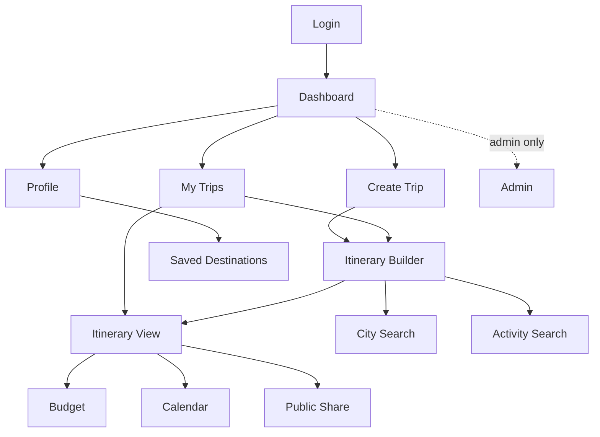

# 🎨 UI / UX & Design System — GlobeTrotter

> "UI is the face of your project." This defines one coherent visual language — colour, type, spacing, components — plus the layout of each screen and the navigation map. Consistency here is a graded criterion.

Reference mockups: [Excalidraw](https://link.excalidraw.com/l/65VNwvy7c4X/6CzbTgEeSr1).

---

## 1. Design Principles

1. **Calm canvas, vivid journey.** Neutral surfaces let destination imagery and the itinerary be the colour.
2. **One primary action per screen.** The next step is always obvious (Create Trip → Add Stop → Add Activity).
3. **Show the plan, not a form.** Favour visual itinerary/calendar/cards over dense forms.
4. **Feedback always.** Every action has a loading, empty, success, and error state. Validation errors are inline and human.
5. **Responsive by default.** Works from 360 px mobile to desktop.

---

## 2. Design Tokens

Single source of truth → `frontend/src/styles/tokens.css`. Never hard-code a hex or px outside this file.

### Colour
A travel-inspired palette: deep **ocean/indigo** as primary, warm **sunset amber** as accent, on calm neutrals. Chosen for AA contrast in light mode.

| Token | Value | Use |
|-------|-------|-----|
| `--color-primary` | `#1E5EFF` | primary buttons, links, active nav |
| `--color-primary-700` | `#1746C4` | hover/pressed |
| `--color-accent` | `#FF8A3D` | highlights, budget callouts, "Plan New Trip" |
| `--color-success` | `#1BA97A` | within-budget, confirmations |
| `--color-warning` | `#E8A400` | approaching budget |
| `--color-danger` | `#E5484D` | over-budget, destructive, errors |
| `--color-bg` | `#F7F8FB` | app background |
| `--color-surface` | `#FFFFFF` | cards, sheets |
| `--color-border` | `#E6E8EE` | dividers, card borders |
| `--color-text` | `#1B1F2A` | primary text |
| `--color-text-muted` | `#5B6472` | secondary text |

> **Category colours** (budget charts) are fixed for consistency: transport `#1E5EFF`, stay `#7A5AF8`, activities `#FF8A3D`, meals `#1BA97A`, misc `#94A3B8`. (See the [dataviz guidance] when building charts — keep hues consistent across pie & bar.)

### Typography
- **Font:** `Inter` (UI) — clean, legible, free. Optional display accent: `Sora` for large headings.
- **Scale (1.25 ratio):** `--fs-xs 12` · `sm 14` · `base 16` · `lg 20` · `xl 25` · `2xl 31` · `3xl 39` (px).
- **Weights:** 400 body, 500 labels, 600 headings, 700 hero.
- **Line-height:** 1.5 body, 1.2 headings.

### Spacing & radius
- **Spacing scale (4 px base):** 4 · 8 · 12 · 16 · 24 · 32 · 48 · 64.
- **Radius:** `--radius-sm 8` · `--radius-md 12` · `--radius-lg 20` (cards) · pill for chips/buttons.
- **Shadow:** `--shadow-card: 0 1px 2px rgba(16,24,40,.06), 0 4px 12px rgba(16,24,40,.06)`.

---

## 3. Layout & Navigation

- **App shell:** left sidebar (desktop) / bottom tab bar (mobile) with: Dashboard · My Trips · Explore (City/Activity search) · Profile. Admin appears only for admins.
- **Top bar:** trip context (name, dates), primary action button, user avatar menu.
- **Trip workspace:** tabbed — *Builder · View · Calendar · Budget · Share* — so a trip's tools stay in one place.

---

## 4. Component Inventory (`components/`)

| Component | Notes |
|-----------|-------|
| `Button` | variants: primary, secondary, ghost, danger; sizes sm/md/lg; loading state |
| `Input` / `Field` | label + input + inline error slot (shows validation messages) |
| `Card` | base surface for trip cards, city cards, activity cards |
| `Modal` / `Sheet` | confirmations (delete trip), quick-edit activity |
| `Tabs` | trip workspace navigation |
| `DatePicker` / `DateRange` | trip & stop dates |
| `Chip` / `Tag` | activity category, filters |
| `Avatar` | user & city thumbnails |
| `EmptyState` | friendly prompts ("No trips yet — Plan New Trip") |
| `Toast` | success/error feedback |
| `Chart` (`Pie`, `Bar`) | budget breakdown (Recharts) |
| `Draggable` list | stops & activities reorder (dnd-kit) |
| `Calendar` | month/timeline of the trip |
| `Skeleton` | loading placeholders |

---

## 5. Screen Layouts (key screens)

### Dashboard
Hero welcome + "Plan New Trip" (accent) → row of **recent trip cards** → **recommended destinations** carousel → **budget highlight** stat tile.

### My Trips
Responsive grid of trip cards: cover image, name, date range, `📍 N stops`, and edit/view/delete on hover (kebab menu on mobile). Empty state front-and-centre.

### Itinerary Builder (core)
Two-pane on desktop:
- **Left:** ordered, **drag-reorderable** list of stops (city + date range + per-stop cost summary). "Add Stop" opens City Search.
- **Right:** the selected stop's **day columns**; each day is a drop zone holding activity blocks (drag to reorder / move between days). "Add Activity" opens Activity Search filtered to that city.
- Single-column stacked on mobile.

### Itinerary View
Day-wise vertical timeline grouped by city headers; each activity block shows time · name · cost. Toggle **List ⇄ Calendar** in the top-right.

### City / Activity Search
Search bar + filter chips (country/region · category/cost/duration). Results as cards with meta (cost index, popularity / duration, cost) and an "Add to Trip" button.

### Budget
Top stat tiles (Total · Avg/day · Budget · Δ remaining). **Pie** = category share; **Bar** = per-day spend with over-budget days coloured `--color-danger`. Category legend uses the fixed category colours.

### Calendar / Timeline
Month grid across trip dates; click a day → expandable panel with its activities; drag to reorder; quick-edit time/cost inline.

### Public / Shared View
Clean, read-only, no chrome: cover, trip summary, itinerary timeline, and a prominent **Copy Trip** + share buttons. No edit affordances.

### Profile / Settings
Editable fields (name, photo, email, language), **Saved Destinations** grid, and a clearly-separated **danger zone** (delete account with confirm).

### Admin (P2)
Stat tiles (users, trips) → line chart (trips over time) → tables (top cities, top activities) → user table with actions.

---

## 6. State & Feedback Patterns

| State | Treatment |
|-------|-----------|
| Loading | skeletons for lists/cards; spinners on buttons |
| Empty | illustrated `EmptyState` + the primary next action |
| Error | inline field errors (from API `422`); toast for request failures with retry |
| Success | toast + optimistic UI (drag-reorder updates instantly, reconciles with server) |
| Destructive | confirmation modal, `danger` styling |

---

## 7. Accessibility & Responsiveness

- Colour contrast AA; never colour-only signalling (over-budget also labelled/iconed).
- All interactive elements keyboard-reachable; visible focus ring (`--color-primary`).
- Breakpoints: `sm 640` · `md 768` · `lg 1024` · `xl 1280`. Sidebar collapses to bottom tabs under `md`; two-pane builder stacks under `lg`.
- Semantic HTML + ARIA labels on icon-only buttons.

---

*Build note:* when implementing, invoke the **frontend-design** and **dataviz** skills to keep the visual system and charts polished and consistent with these tokens.
